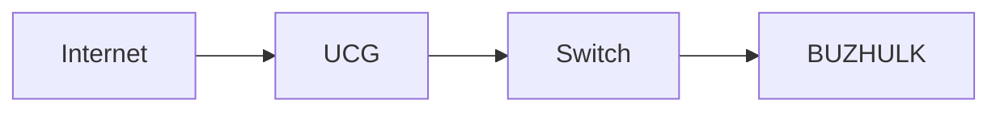

# LeanDocs — Master Project Specification

> **LeanDocs** — _Documentation without the bloat._

|                                |                                                                                                                                                  |
| ------------------------------ | ------------------------------------------------------------------------------------------------------------------------------------------------ |
| **Status**                     | Approved product & architecture specification                                                                                                    |
| **Document version**           | 0.4                                                                                                                                              |
| **Target application release** | 1.0                                                                                                                                              |
| **Project type**               | Self-hosted documentation manager / technical knowledge base                                                                                     |
| **Primary use case**           | Documentation of IT infrastructure, homelabs, applications, procedures and configuration                                                         |
| **Deployment model**           | Docker, single self-hosted instance                                                                                                              |
| **Core principle**             | **The filesystem is the source of truth**                                                                                                        |
| **Related documents**          | [`UI_SPEC.md`](UI_SPEC.md), [`AGENTS.md`](AGENTS.md), [`docs/implementation-status.md`](docs/implementation-status.md), [`docs/adr/`](docs/adr/) |

### Revision history

| Version | Date       | Change                                                                                                                                                                                                                                                                                                                                                                       |
| ------- | ---------- | ---------------------------------------------------------------------------------------------------------------------------------------------------------------------------------------------------------------------------------------------------------------------------------------------------------------------------------------------------------------------------- |
| 0.1     | 2026-10-01 | Initial specification (Polish draft, archived in `docs/archive/pl/`).                                                                                                                                                                                                                                                                                                        |
| 0.2     | 2026-10-02 | Translated to English (English is the only project language). Product name set to **LeanDocs**. Data directory layout unified to `/data/content` + `/data/system`. UI direction approved in `UI_SPEC.md`, so design tokens are applied from Phase 3 onward and Phase 16 becomes a conformance/polish phase. Logo and banner are still pending (`BRAND_SPEC.md` will follow). |
| 0.4     | 2026-10-04 | Phase 11 security review: fail-closed recovery of durable authentication; distinguish rebuilding derived tables from resetting accounts (ADR-0019).                                                                                                                                                                                                                          |
| 0.3     | 2026-10-04 | Owner requested Argon2id with legacy scrypt upgrade; optional local TOTP MFA added to Phase 11 after sessions, CSRF and throttling, before security review.                                                                                                                                                                                                                  |

---

## 1. Purpose of this document

This document is the master specification of LeanDocs. It serves simultaneously as:

- Product Requirements Document;
- Software Requirements Specification;
- architecture description;
- implementation plan;
- roadmap;
- source of design principles;
- source of acceptance criteria;
- instructions for AI assistants working on the code;
- the reference point for every further decision.

AI assistants implementing the project must treat this document as authoritative over their own assumptions.

If the code and this document contradict each other, determine the cause of the discrepancy instead of changing the architecture on your own.

---

## 2. The problem

Existing documentation/note-taking applications usually fall into one of two categories.

1. **Simple Markdown tools** — great data portability, but they require writing Markdown syntax by hand.
2. **Large PKM / knowledge-base systems** — convenient UI, but they:
   - ship many features unrelated to documentation;
   - impose their own data model;
   - increase lock-in;
   - store documents primarily in a database;
   - make migration harder;
   - raise infrastructure requirements;
   - distract from the core job: writing documentation.

LeanDocs fills the gap between these two approaches.

---

## 3. Product vision

LeanDocs is:

> a simple, fast and modern web documentation system in which the user writes as comfortably as in a WYSIWYG editor, while the documents remain plain Markdown files.

```text
Filesystem
    ↓
Markdown files
    ↓
Application
    ├── View
    ├── Visual Edit
    ├── Source Edit
    ├── Search
    ├── Navigation
    └── Relationships
```

The application does not own the documentation. The application is an interface to the documentation.

---

## 4. Fundamental principles

### 4.1. Filesystem first

The canonical source of a document is a file on the filesystem.

```text
content/
├── Infrastructure/
│   ├── Servers/
│   │   ├── BUZHULK.md
│   │   └── BUZPI00.md
│   └── Storage/
│       └── Synology.md
├── Network/
│   ├── UniFi.md
│   ├── VLAN.md
│   └── DNS.md
└── Applications/
    ├── Home-Assistant.md
    └── Vaultwarden.md
```

Removing the application must never make the documentation unusable. A document must be openable in VS Code, Vim, Nano, Obsidian, Typora, GitHub, GitLab or any text editor that understands Markdown.

### 4.2. Markdown first

The primary document format is `*.md`.

Document content must **not** be stored as:

- ProseMirror JSON;
- TipTap JSON;
- an SQLite record;
- editor-generated HTML;
- any proprietary document format.

Editor state may be represented internally by a ProseMirror model, but the final save must be serialized to Markdown.

### 4.3. The database is not the content store

SQLite may hold:

- the search index;
- auxiliary metadata;
- cache;
- link information and backlinks;
- user information, settings and sessions;
- technical application state.

SQLite must never be the only place where document content lives. Losing or deleting the database must not lose any documentation. The index must always be rebuildable from the filesystem.

---

## 5. Product positioning

LeanDocs is **not** designed as a Notion, Obsidian or Trilium replacement, a task manager, project manager, personal CRM, calendar, journal, whiteboard, kanban board or database builder.

It **is** designed as a _documentation browser and editor_, closer to:

```text
GitBook + VS Code Explorer + modern Markdown WYSIWYG editor + technical wiki
```

than to a full PKM system.

---

## 6. Primary user

Version 1.0 targets a **single-user, self-hosted, technical documentation** scenario.

Typical content: homelab documentation, servers, networks, Docker, procedures, runbooks, troubleshooting, application docs, configuration docs, architecture diagrams, technical notes, procedural checklists, recovery instructions, change documentation.

The architecture must not prevent multi-user support in the future, but multi-user is not a 1.0 requirement.

---

## 7. Core user experience

A document has three main states:

```text
VIEW
  ↓
EDIT
  ├── VISUAL
  └── SOURCE
```

### VIEW

The default way of using the documentation. The renderer displays headings, text, lists, tables, code, diagrams, images, attachments, callouts, links and a table of contents. Editor chrome must not get in the way of reading.

### VISUAL EDIT

The primary authoring mode. The user does not need to know Markdown. Must support at least: bold, italic, headings, bullet list, numbered list, checklist, blockquote, inline code, code block, link, image, table, horizontal rule, callout.

The visual editor must work on a document model that can be safely serialized back to Markdown.

### SOURCE EDIT

Full Markdown source editing with: syntax highlighting, optional line numbers, find, replace, undo, redo, tab handling, bracket handling, keyboard shortcuts.

Switching `Visual → Source → Visual` must never cause uncontrolled content loss.

---

## 8. Canonical document format

```markdown
---
id: 77ce39fd-03cd-4d78-9e8f-87828449e0aa
title: BUZHULK
created: 2026-10-02T00:00:00Z
updated: 2026-10-02T00:00:00Z
tags:
  - server
  - docker
  - incus
aliases:
  - docker-host
icon: server
---

# BUZHULK

Main Docker and Incus host.

## Hardware

- GMKTEC G3
- Intel N100
- Intel I226-V

## Services

...
```

---

## 9. Front matter

YAML front matter is used.

**Required fields:** `id`, `title`, `created`, `updated`.

**Optional fields:** `tags`, `aliases`, `icon`, `template`, `description`.

Rules:

- `id` — UUID; never changes on rename or move.
- `title` — the display name; does not have to match the file name.
- `created` — set when the document is created (ISO 8601, UTC).
- `updated` — updated on every save (ISO 8601, UTC).
- `tags` — array of strings.
- `aliases` — alternative names used for search and linking.

Unknown front matter keys must be preserved verbatim on save.

---

## 10. File names

File names must be human-readable:

```text
Home Assistant.md
Nginx Proxy Manager.md
BUZHULK.md
Docker Backup.md
```

Do not force UUID file names — the UUID lives in front matter.

File names must be sanitized; `../`, `./`, NUL and any other path traversal attempts are rejected.

---

## 11. Directory structure

The filesystem structure _is_ the navigation structure.

```text
content/
├── Infrastructure/
├── Network/
├── Applications/
├── Procedures/
└── Troubleshooting/
```

Folder structure must not be stored only in the database. Drag & drop of a folder or document in the UI must correspond to a real filesystem operation.

---

## 12. System folders

The content directory may contain reserved folders:

```text
content/
├── _templates/
├── _trash/
└── ...
```

System folders (prefixed with `_`) are hidden from the main documentation tree by default. Dot-folders (e.g. `.git`) are always ignored.

---

## 13. Attachments

Preferred model — a sibling assets folder per document:

```text
BUZHULK.md
BUZHULK.assets/
├── network.png
├── architecture.svg
└── compose.yaml
```

Benefits: document and files stay together; easy migration, backup and copying; no global blob store.

Moving a document must also move its `.assets` folder. Renaming a document must rename its `.assets` folder accordingly. `*.assets` folders are not shown as folders in the navigation tree.

---

## 14. Supported attachments

Minimum: PNG, JPEG, WEBP, SVG, PDF, TXT, YAML, JSON, ZIP.

Per-file size limit is configurable; default **50 MB**.

Validate: name, extension, MIME type, size. Executable files are blocked by default. SVG is served with a restrictive content type / CSP so it cannot execute scripts.

---

## 15. Drag & drop / clipboard

**Paste a screenshot (`Ctrl+V`):** the app (1) saves the image in `<note>.assets/`, (2) generates a safe file name, (3) inserts a Markdown image link.

**Drag a file onto the editor:** the app (1) uploads the file, (2) stores it in assets, (3) inserts a link.

---

## 16. Markdown profile

A predictable Markdown subset is used. Required: CommonMark, GitHub Flavored Markdown, tables, task lists, fenced code, autolinks, strikethrough. Extensions: callouts (§18), wiki links (§22), Mermaid (§20).

---

## 17. Raw HTML

Raw HTML may be supported as an extension, but it is not a primary document format. HTML:

- may appear inside a Markdown file;
- must be sanitized;
- must never execute JavaScript;
- must never bypass application security.

The visual editor does not need to edit arbitrary HTML visually. An unsupported HTML block may be shown as an opaque `[HTML BLOCK]` node that is preserved verbatim; editing happens in Source mode.

---

## 18. Callouts

Technical information blocks. Preferred syntax (container directives):

```markdown
:::note
Information.
:::

:::warning
Do not enable Secure Boot for the HAOS VM.
:::

:::danger
This operation may cause data loss.
:::
```

Minimum types: `note`, `info`, `tip`, `warning`, `danger`.

---

## 19. Code blocks

Code is a first-class citizen.

````markdown
```yaml
services:
  vaultwarden:
    image: vaultwarden/server
```
````

Renderer: syntax highlighting, copy button, whitespace preserved, language label. The visual editor must allow creating and editing code blocks.

---

## 20. Mermaid

The app renders Mermaid code fences:

````markdown

````

Rendering is part of View mode; the source stays plain Mermaid text. An invalid diagram must never break the document — show `Diagram rendering error` together with a way to view its source. Mermaid must run with `securityLevel: 'strict'` (or stricter).

---

## 21. Table of contents

For documents with headings the app generates an automatic TOC that:

- is **not** written into the `.md` file;
- is derived from the document AST;
- links to headings;
- may be collapsible.

---

## 22. Links

Standard Markdown links are supported:

```markdown
[BUZHULK](../Infrastructure/Servers/BUZHULK.md)
```

as well as convenient wiki links:

```markdown
[[BUZHULK]]
[[BUZHULK#Hardware]]
[[BUZHULK|the Docker host]]
```

Wiki links are an application feature. Standard Markdown links remain the more interoperable format.

---

## 23. Link autocomplete

After typing `[[`, the visual and source editors may show a document picker. Matching considers title, aliases, file name and path.

---

## 24. Backlinks

The app indexes links between documents. A document can show a panel:

```text
Referenced by
─────────────
Home Assistant
Nginx Proxy Manager
Network Architecture
```

Backlinks are **not** written into the source `.md`; they are derived index data.

---

## 25. Broken links

The indexer detects links pointing to non-existent documents. The app provides a _Broken links_ overview, e.g.:

```text
Docker.md
→ ../Network/Old-VLAN.md
→ target not found
```

---

## 26. Rename and move

Renaming or moving a document must not needlessly break relationships. For `Network/UniFi.md → Infrastructure/Network/UniFi.md` the app must:

1. move the file;
2. move the assets folder;
3. find links pointing to the old path;
4. update links managed by the app (relative Markdown links; wiki links resolve by title/alias and usually need no change);
5. refresh the index.

The operation must be as atomic as the filesystem allows, and must never silently overwrite an existing target.

---

## 27. External file changes

Users may change documents outside the app (VS Code, `git pull`, rsync, scripts). The backend watches the filesystem:

```text
file change → filesystem watcher → parse document → update index → notify frontend
```

The app must never assume it is the only process modifying files.

---

## 28. Edit conflicts

When a document is opened the frontend receives a `revision` (content hash, e.g. `sha256:…`). Saves include `expectedRevision`. If the file changed in the meantime the API returns **409 Conflict** and the UI shows:

```text
This document changed outside the editor.

Review changes
Reload
Save as copy
```

Changes are never overwritten automatically.

---

## 29. Atomic writes

Saving uses:

```text
write temporary file (same directory)
    ↓
fsync / flush where appropriate
    ↓
rename temporary → target
```

to minimise the risk of a partially written document.

---

## 30. Search

Global search is one of the most important features. It indexes: title, body, headings, tags, aliases, file name, path.

```text
Ctrl + K → "macvlan"

Home Assistant
…macvlan-shim used for host communication…

BUZHULK
…Incus VM uses macvlan…

Troubleshooting
…NPM 502 caused by macvlan…
```

---

## 31. SQLite FTS

Full-text search uses **SQLite FTS5**. The index is derived data. A _Rebuild Search Index_ function must exist and:

1. drop the old index;
2. scan all documents;
3. parse front matter;
4. parse content;
5. rebuild documents;
6. rebuild relationships;
7. rebuild FTS.

---

## 32. Search ranking

Results prefer, in order: (1) exact title, (2) title prefix, (3) alias, (4) tag, (5) heading, (6) body. Results show a snippet containing the matched phrase.

---

## 33. Search filters

Target syntax:

```text
tag:docker
path:Infrastructure
title:BUZHULK
docker tag:server
```

Advanced filters must not block the MVP.

---

## 34. Quick open

Independent from full-text search: `Ctrl/Cmd + P` opens a document by title, file name, aliases or path.

---

## 35. Templates

Templates are plain Markdown files:

```text
_templates/
├── Server.md
├── Application.md
├── Procedure.md
├── Network Device.md
└── Incident.md
```

Supported placeholders: `{{title}}`, `{{date}}`. A document created from a template is a completely normal `.md` file; deleting the template later does not affect it.

---

## 36. Example template — Server

```markdown
# {{title}}

## Overview

## Hardware

## Operating System

## Network

## Storage

## Services

## Backup

## Monitoring

## Maintenance

## Troubleshooting

## References
```

Example — Application:

```markdown
# {{title}}

## Overview

## Deployment

## Configuration

## Network

## Volumes

## Backup

## Update procedure

## Troubleshooting
```

---

## 37. Creating a document

Dialog: **Name**, **Location**, **Template** (`Blank`, `Server`, `Application`, `Procedure`, `Network Device`, `Incident`).

On confirm: (1) generate UUID, (2) generate front matter, (3) create the `.md` file, (4) open it in Visual Edit.

---

## 38. Deleting a document

Version 1.0 never deletes permanently in one step. A deleted document moves to `_trash/` together with metadata allowing restore (original path, deletion time). The UI provides: Trash, Restore, Delete permanently, Empty trash.

---

## 39. Home

Home must not become an analytics dashboard. Minimum: recent documents, recently updated, pinned documents, quick actions (New document, Search, Open recent).

---

## 40. Favorites / pins

Users can pin documents. A pin is application metadata and does not modify the `.md`. Pinned documents are accessible from the sidebar.

---

## 41. Tags

Tags live in front matter. The UI supports assigning, removing, autocomplete and filtering. A tag is not a separate managed database object; the tag list is derived from documents.

---

## 42. Navigation tree

The tree is generated from the filesystem. Functions: expand, collapse, create/rename/move folder, create/rename/move document, context menu, drag & drop. Expanded/collapsed state may be stored as a user preference.

---

## 43. Functional layout

Visual styling is defined in [`UI_SPEC.md`](UI_SPEC.md). Functional layout:

```text
┌───────────────────────────────────────────────────────┐
│ Header / Search / Actions                             │
├─────────────┬──────────────────────────┬──────────────┤
│ Navigation  │ Document                 │ Context      │
│ Tree        │ View / Editor            │ (optional)   │
└─────────────┴──────────────────────────┴──────────────┘
```

The context panel may contain TOC, properties, backlinks and document information, and is optional.

---

## 44. Responsive behaviour

Desktop is the main platform. Tablet and phone must still allow searching, reading, basic editing and creating documents. On small screens the navigation tree works as a drawer. Do not try to keep three columns on a phone.

---

## 45. Keyboard shortcuts

Minimum:

```text
Ctrl/Cmd + K           global search
Ctrl/Cmd + P           quick open
Ctrl/Cmd + S           save
Ctrl/Cmd + B           bold
Ctrl/Cmd + I           italic
Ctrl/Cmd + Z           undo
Ctrl/Cmd + Shift + Z   redo
Esc                    close dialog
```

Later: `Ctrl/Cmd + E` toggles View/Edit.

---

## 46. Autosave

```text
editing → local editor state → debounce → save
```

A Save button remains available. Save state is always visible: `Saved`, `Saving…`, `Unsaved`, `Conflict`, `Error`. Autosave must never hide errors.

---

## 47. Unsaved-change recovery

The frontend keeps an uncommitted local draft (browser storage) in case of a browser crash. On reopen:

```text
Unsaved local changes found
Restore    Discard
```

A local draft never replaces the server document automatically.

---

## 48. Authentication

Version 1.0 is single-user. Supported modes:

```text
AUTH_MODE=local   (default)
AUTH_MODE=proxy
AUTH_MODE=none
```

## 49. Local authentication

First run: _Create administrator account_. Storage: salted Argon2id password hash (legacy scrypt hashes are verified and upgraded on successful login), never plaintext; secure cookie session (`HttpOnly`, `SameSite`, `Secure` when served over HTTPS).

Optional local TOTP MFA belongs to Phase 11 after sessions, CSRF and login throttling, before the final security review. Enrollment requires confirmation; recovery codes are one-use; disabling MFA requires reauthentication. Keep the 15-character minimum until MFA policy is revisited. The owner authorized this scope on 2026-10-04.

## 50. Proxy authentication

`AUTH_MODE=proxy` is for running behind a trusted reverse proxy / auth gateway. It must never trust arbitrary headers from the Internet; a trusted-proxy configuration is required.

## 51. No authentication

`AUTH_MODE=none` is allowed only as a deliberate user configuration. The UI shows a warning in Settings.

---

## 52. Security

From the start, account for: path traversal prevention, XSS protection, HTML sanitization, CSRF protection, secure sessions, upload validation, size limits, MIME validation, safe Markdown rendering, safe Mermaid rendering, Content Security Policy, security headers, login rate limiting, safe file name handling.

## 53. Telemetry

**No telemetry** by default. The app never sends user data or document information to external services. No trackers. No runtime CDN dependencies — all frontend assets are bundled.

---

## 54. Architecture

```text
                    Browser
                       │
                       ▼
                 React Frontend
                       │
                REST API (+ SSE for change events)
                       │
                       ▼
                 Fastify Backend
           ┌───────────┼────────────┐
           ▼           ▼            ▼
       Filesystem    SQLite       Watcher
           │           │            │
           ▼           ▼            ▼
       Markdown      FTS5        Reindex
       Assets        metadata
```

Invariant:

```text
SQLite deleted       → Markdown survives; rebuild derived data, restore configured auth
Application deleted  → documents still work
Docker deleted       → documents still work
```

---

## 55. Technology stack

| Area               | Choice                                                    | Notes                                                                           |
| ------------------ | --------------------------------------------------------- | ------------------------------------------------------------------------------- |
| Language           | TypeScript                                                | frontend and backend                                                            |
| Runtime            | Node.js LTS (24.x)                                        |                                                                                 |
| Frontend           | React, Vite                                               |                                                                                 |
| Styling            | CSS variables (design tokens) per `UI_SPEC.md`            | component library must not leak into application logic                          |
| Visual editor      | Milkdown (ProseMirror + remark)                           | headless WYSIWYG Markdown; ProseMirror state is never the canonical document    |
| Source editor      | CodeMirror 6                                              |                                                                                 |
| Backend            | Fastify                                                   | current major (5.x)                                                             |
| Database           | SQLite + FTS5 via `better-sqlite3`                        | switching (e.g. to `node:sqlite`) requires an explicit ADR, never a silent swap |
| File watcher       | chokidar (or an equivalent stable cross-platform watcher) |                                                                                 |
| Markdown           | unified / remark / rehype                                 |                                                                                 |
| Diagrams           | Mermaid                                                   |                                                                                 |
| Icons              | Tabler Icons                                              | per `UI_SPEC.md`                                                                |
| Server state (web) | TanStack Query                                            | per `UI_SPEC.md`                                                                |
| Package manager    | pnpm (via corepack)                                       |                                                                                 |
| Tests              | Vitest (unit/integration), Playwright (e2e)               |                                                                                 |

---

## 56. Monorepo

```text
/
├── apps/
│   ├── web/
│   └── server/
├── packages/
│   └── shared/
├── docs/
├── docker/
├── AGENTS.md
├── PROJECT_SPEC.md
├── UI_SPEC.md
├── README.md
├── package.json
├── pnpm-workspace.yaml
└── compose.yaml
```

---

## 57. Backend modules

```text
apps/server/src/
├── auth/
├── config/
├── documents/
├── filesystem/
├── indexer/
├── search/
├── links/
├── attachments/
├── templates/
├── trash/
├── settings/
├── watcher/
└── api/
```

Modules are separated by responsibility. Route handlers must not contain filesystem logic directly.

## 58. Frontend modules

```text
apps/web/src/
├── app/
├── api/
├── components/
├── editor/
│   ├── visual/
│   └── source/
├── documents/
├── navigation/
├── search/
├── settings/
├── hooks/
├── styles/        (design tokens)
└── utils/
```

---

## 59. API conventions

Base path: `/api/v1`. JSON. Standard error response:

```json
{
  "error": {
    "code": "DOCUMENT_CONFLICT",
    "message": "Document has changed",
    "details": {}
  }
}
```

Shared request/response types live in `packages/shared`.

## 60. Minimal API

```text
Health
GET    /api/v1/health

Authentication
POST   /api/v1/auth/login
POST   /api/v1/auth/logout
GET    /api/v1/auth/session

Tree
GET    /api/v1/tree

Documents
GET    /api/v1/documents/:id
POST   /api/v1/documents
PUT    /api/v1/documents/:id
DELETE /api/v1/documents/:id

Document operations
POST   /api/v1/documents/:id/move
POST   /api/v1/documents/:id/rename
POST   /api/v1/documents/:id/restore

Search
GET    /api/v1/search?q=

Links
GET    /api/v1/documents/:id/links
GET    /api/v1/documents/:id/backlinks

Attachments
POST   /api/v1/documents/:id/attachments
DELETE /api/v1/documents/:id/attachments/:filename

Index
POST   /api/v1/index/rebuild
GET    /api/v1/index/status

Templates
GET    /api/v1/templates
```

Folder operations (create/rename/move/delete folder), trash listing and change events (SSE) are added in the phases that need them and documented in `docs/architecture.md`.

## 61. Document DTO

```json
{
  "id": "77ce39fd-03cd-4d78-9e8f-87828449e0aa",
  "title": "BUZHULK",
  "path": "Infrastructure/Servers/BUZHULK.md",
  "content": "# BUZHULK...",
  "frontmatter": { "tags": ["server", "docker"] },
  "revision": "sha256:...",
  "created": "...",
  "updated": "..."
}
```

`content` is the Markdown body without front matter; `frontmatter` contains all front matter keys.

---

## 62. Index lifecycle

```text
start → open database → verify schema → load filesystem → compare index
      → incremental update → start watcher → ready
```

A full rebuild must not be required on every restart.

Authentication is durable application data, distinct from the derived index. Existing corrupt, empty or unreadable databases must stop startup without replacement. A configured installation whose database is missing or reset must not reopen account setup; preserve a private initialization marker outside SQLite (ADR-0019). Restore matching authentication backups before serving content again. Index rebuilds retain users, sessions, MFA, settings and pins.

## 63. Database schema (conceptual)

- `documents` — `id`, `path`, `filename`, `title`, `description`, `created_at`, `updated_at`, `mtime`, `content_hash`
- `tags`, `document_tags`
- `links`
- `documents_fts` (FTS5)
- `settings`
- `users`, `sessions`

Document text may appear in FTS as a derived index, but the source of content is still the `.md` file.

## 64. Parser pipeline

```text
Markdown file → front matter parser → Markdown parser → AST
                                                         ├── TOC
                                                         ├── links
                                                         ├── tags
                                                         └── search text
```

The parser is a shared layer for renderer, backlinks, search, TOC and validation (lives in `packages/shared` where it must run in both browser and server).

## 65. Renderer

The renderer never executes unsafe HTML.

```text
Markdown → AST → plugins → sanitization → React / HTML rendering
```

---

## 66. Import / migration

Leave room for importers from the start. Logical interface:

```text
Importer
  detect()
  scan()
  preview()
  convert()
  import()
```

## 67. Import: Markdown directory

First importer: _Generic Markdown Directory_. It must preserve folder structure and `.md` files, detect existing front matter, add missing UUIDs, and never destroy existing information.

## 68. Import: HTML

```text
.html → HTML parser → Markdown conversion → review report
```

The import produces a report of elements that could not be converted safely. Original files are never deleted.

## 69. Migration from Poznote

Target: `.md`, `.html`, folder structure, attachments. The core must not depend on the Poznote format — the importer is a separate adapter.

## 70. Migration from Obsidian

Vault → Markdown directory import. Preserve folders, Markdown, attachments and wiki links where possible.

## 71. Migration from Jotty

If documents are already Markdown: keep the files, add missing IDs, reindex.

---

## 72. Git integration (extended scope)

The core does not require Git. Git is an optional feature: initialize repository, commit, history, diff, restore version; optionally auto-commit (e.g. when an editing session ends).

## 73. Git rule

Git must never be required to start the app, edit documents, search or back up.

## 74. Backup

The most important directory to back up is `/data/content`. No special exporter is required — `rsync`, `restic`, `borg`, snapshots or `tar` are enough. SQLite should be backed up too, but losing it never means losing documents.

## 75. Restore

Restoring only `content/` into a genuinely new, privately initialized installation must rebuild documentation and search. A previously configured installation also needs its matching authentication backup; losing app state must not silently remove access protection or reopen setup (ADR-0019). This is an architecture acceptance criterion.

---

## 76. Docker deployment

A single application container:

```yaml
services:
  leandocs:
    image: ghcr.io/<owner>/leandocs:latest
    volumes:
      - ./data:/data
    ports:
      - '8080:8080'
    restart: unless-stopped
```

No PostgreSQL, Redis, RabbitMQ, Elasticsearch or MinIO.

## 77. Container filesystem

```text
/data/
├── content/          ← documents, folders, assets, _templates, _trash
└── system/
    └── app.db        ← SQLite (index, settings, sessions)
```

No important data may live only in the ephemeral container filesystem.

## 78. Configuration

Environment variables. Minimum: `PORT`, `DATA_DIR`, `AUTH_MODE`, `LOG_LEVEL`, `MAX_UPLOAD_SIZE`. Secrets are never committed to the repository.

## 79. Reverse proxy

Must work behind Nginx, Nginx Proxy Manager, Traefik and Caddy, including forwarded headers, HTTPS termination and SSE/WebSocket if used. Never hard-code the hostname.

## 80. Base path

If the architecture allows, plan for a `BASE_PATH` setting. Not blocking for MVP.

## 81. Logging

Structured logging (pino via Fastify). Minimum fields: timestamp, level, message, module, requestId. Never log passwords, session tokens, full documents or secrets.

## 82. Health checks

`GET /api/v1/health` returns `{ "status": "ok" }` and is used as the Docker healthcheck.

## 83. Error handling

Users never see raw stack traces. The frontend shows understandable messages; the backend logs details.

## 84. Performance targets

Comfortable up to **10,000 documents**; typical deployment 100–3,000. Search returns results practically instantly. The tree must not require reading the content of all documents (front matter/titles come from the index).

## 85. Caching

No Redis. Process memory, SQLite and browser cache are enough.

---

## 86. Testing strategy

Tests from day one, in three layers: unit, integration, e2e.

## 87. Unit tests

Minimum: front matter parser, path sanitizer, file name sanitizer, Markdown parser, link parser, wiki-link resolver, rename logic, move logic, revision calculation, search query parser.

## 88. Integration tests

Use a real temporary filesystem. Scenarios: create, read, update, move, rename, delete, restore note; external change; conflict; reindex; attachment upload.

## 89. API tests

Use Fastify request injection (`app.inject`) instead of a running server wherever possible.

## 90. Frontend tests

Minimum: navigation tree, search, opening a document, editor state, conflict dialog, save status.

## 91. E2E

Playwright. Key scenarios:

| ID     | Scenario                                                          |
| ------ | ----------------------------------------------------------------- |
| E2E-01 | login → create document → edit → save → refresh → document exists |
| E2E-02 | create folder → move note → refresh → tree preserved              |
| E2E-03 | upload image → image rendered → asset exists on disk              |
| E2E-04 | search phrase → correct document returned                         |
| E2E-05 | external file modification → app detects change                   |

## 92. Quality gates

Every merge to `main` passes: lint, typecheck, unit tests, integration tests, build. E2E may run in an extended pipeline.

## 93. CI/CD

GitHub Actions (or compatible):

```text
push → install → lint → typecheck → test → build
release tag → build Docker image → push to GHCR
```

## 94. Docker tags

`latest`, `1`, `1.0`, `1.0.0`, `sha-xxxx`.

---

## 95. Repository documentation

The repository contains:

```text
README.md
AGENTS.md                      (instructions for all AI coding agents)
CLAUDE.md                      (pointer to AGENTS.md)
PROJECT_SPEC.md
UI_SPEC.md
BRAND_SPEC.md                  (later — branding phase)
CONTRIBUTING.md
CHANGELOG.md
SECURITY.md
LICENSE                        (pending owner decision)

docs/
├── implementation-status.md   (single source of truth for progress)
├── adr/
├── architecture.md            (created/extended as phases land)
├── development.md             (Phase 0)
├── markdown.md                (Phase 4)
├── configuration.md           (Phase 14)
└── deployment.md              (Phase 14)
```

## 96. `docs/implementation-status.md`

This file is especially important when several AI assistants work on the project. It contains: current phase, task board with claim markers, known issues, technical decisions, open questions, next tasks and a work log. Agents update it when they claim a task, when they finish a task and at the end of every session. The exact protocol is defined in [`AGENTS.md`](AGENTS.md).

## 97. Architecture Decision Records

Significant decisions are recorded in `docs/adr/NNNN-title.md` (template: `docs/adr/0000-template.md`). ADRs are not required for minor decisions.

## 98. Development philosophy

> **Do not build functionality before it is needed.**

Prefer **simple, explicit, portable, testable, maintainable** over clever, generic, enterprise, abstract or future-proof-at-all-costs.

## 99. Explicitly out of scope for 1.0

Multi-user collaboration; realtime collaborative editing; Kanban; calendar; reminders; time tracking; whiteboard; database views; spreadsheets; knowledge-graph visualization; AI assistant; vector database; embeddings; chat with documents; plugin marketplace; email integration; native mobile app; S3 storage; WebDAV; automatic cloud sync; public publishing platform.

The absence of these features is a deliberate product decision, not a gap.

---

## 100. Implementation roadmap

The project is built in phases. Each phase has scope, deliverables, acceptance criteria and a gate. AI agents must not implement several large phases at once. Task-level breakdown and status live in [`docs/implementation-status.md`](docs/implementation-status.md).

### PHASE 0 — Repository bootstrap

**Goal:** a stable development foundation.

1. Create the repository.
2. Configure the pnpm workspace.
3. Create `apps/web`, `apps/server`, `packages/shared`.
4. Configure TypeScript.
5. Configure lint.
6. Configure the formatter.
7. Configure the test runner.
8. Minimal Fastify server.
9. Minimal React frontend.
10. `GET /api/v1/health`.
11. Development scripts.
12. Dockerfile (dev/build).
13. Basic CI.

**Acceptance:** `pnpm install`, `pnpm dev`, `pnpm build`, `pnpm test`, `pnpm lint`, `pnpm typecheck` work. The frontend talks to the backend. The health endpoint works.
**Gate:** do not start document features until build/test/lint are stable.

### PHASE 1 — Filesystem core

**Goal:** the most important layer of the project.
**Scope:** data directory, content directory, folder scanning, note discovery, front matter parser, stable UUID, safe path handling.
**Functions:** scan content, list tree, read note, create note, update note. No advanced UI yet.
**Tests must cover:** empty directory, nested folders, invalid Markdown, missing front matter, duplicate ID, unsafe paths.
**Acceptance:** manually creating `/data/content/Test.md` makes the backend detect the document; it can be fetched via the API; its content physically lives in the `.md`.

### PHASE 2 — Document CRUD

**Goal:** complete document management.
**Scope:** create, read, update, rename, move, trash, restore, permanent delete; atomic writes; revision; conflict detection.
**Acceptance:** the whole document lifecycle works via the API. After every operation the filesystem matches the application state. A document can never exist only in SQLite.

### PHASE 3 — Navigation UI

**Goal:** the first genuinely usable frontend.
**Scope:** app shell, navigation tree, document view, folder expansion, create document, rename, move, delete, context menus, recent documents.
**Styling:** use the design tokens and layout from `UI_SPEC.md` (tokens first, see UI_SPEC §162–163). Pixel-level polish is deferred to Phase 16.
**Acceptance:** the user can manage the entire documentation structure from the browser.

### PHASE 4 — Markdown rendering

**Goal:** full reading experience.
**Scope:** headings, paragraphs, links, images, tables, lists, task lists, blockquotes, inline code, code fences, syntax highlighting, TOC; then callouts and Mermaid.
**Acceptance:** a typical technical Markdown file renders correctly. Unsafe HTML never executes.

### PHASE 5 — Source editor

**Goal:** full Markdown editing.
**Scope:** CodeMirror; open, edit, save, autosave, dirty state, shortcuts, conflict handling.
**Acceptance:** the app is usable as a complete Markdown documentation manager even without the visual editor. **First functional milestone.**

### PHASE 6 — Visual editor

**Goal:** remove the need to write Markdown by hand.
**Scope:** Milkdown with at least headings, bold, italic, lists, numbered lists, task lists, blockquotes, code, code blocks, links, images, tables.
**Critical test:** `Source → Visual → modify → Source` must not lose semantically significant elements (round-trip fixture suite).
**Acceptance:** a user can create typical technical documentation without writing Markdown.

### PHASE 7 — Attachments

**Goal:** complete technical docs with images and files.
**Scope:** upload, clipboard image, drag & drop, image rendering, generic attachments, delete, asset migration on move, validation.
**Acceptance:** a screenshot pasted with `Ctrl+V` exists as a plain file in the assets folder after saving.

### PHASE 8 — Search & indexing

**Goal:** finding information very fast.
**Scope:** SQLite schema, FTS5, indexer, incremental indexing, rebuild, search UI, `Ctrl+K`, snippets, ranking.
**Acceptance:** changing a document updates search results. Clearing derived index tables + rebuild restores full search while retaining authentication. Fresh isolated index databases also demonstrate filesystem portability.

### PHASE 9 — Links & backlinks

**Goal:** a lightweight knowledge graph without a graph view.
**Scope:** Markdown links, wiki links, autocomplete, link resolver, backlinks, broken links, link update on move/rename.
**Acceptance:** a document can reference another document and the relationship is visible from both sides.

### PHASE 10 — Templates, tags, properties

**Scope:** templates (Blank, Server, Application, Procedure, Network Device, Incident); tags (add, remove, autocomplete, filter); properties panel (title, path, created, updated, tags, aliases).
**Acceptance:** creating typical infrastructure documentation requires minimal repetitive work.

### PHASE 11 — Authentication & hardening

**Scope:** first run, local account, sessions, logout, proxy mode, none mode, security headers, rate limiting, CSRF, sanitization, security review.
**Acceptance:** the app can be safely exposed over HTTPS behind a reverse proxy.

### PHASE 12 — File watcher & external changes

**Scope:** filesystem watcher, incremental reindex, frontend notification, conflict handling.
**Test:** app open → edit the same Markdown in VS Code → app detects the update.
**Acceptance:** the filesystem truly remains the source of truth even when files are changed outside the app.

### PHASE 13 — Import / migration

**Scope:** generic Markdown (highest priority); HTML with conversion report; Obsidian (on top of the Markdown importer); Poznote (dedicated adapter only if needed).
**Acceptance:** an existing Markdown library can be imported without copying documents by hand.

### PHASE 14 — Deployment

**Scope:** production Dockerfile, `compose.yaml`, healthcheck, persistent volume, environment configuration, reverse-proxy documentation, DB migration strategy, version reporting.
**Acceptance:** `docker compose up -d` is enough to run the app.

### PHASE 15 — Release hardening

Dependency audit, security review, filesystem corruption tests, upgrade tests, backup/restore tests, migration tests, performance tests, accessibility review, browser testing, documentation review.

### PHASE 16 — UI conformance & polish

The UI direction was chosen and specified in [`UI_SPEC.md`](UI_SPEC.md) (direction A — Technical Minimal). This phase verifies every screen against `UI_SPEC.md` §160 acceptance criteria, completes dark mode, responsive behaviour and visual regression tests, and applies `BRAND_SPEC.md` (logo, icon, banner, final accent colour) once it exists.

### PHASE 17 — Release 1.0

**Core:** filesystem-first, Markdown-first, visual editor, source editor, folders, attachments, search, backlinks, templates, tags, authentication, Docker.
**Reliability:** backup, restore, rebuild, external edits and upgrade tested.
**Documentation:** installation, update, backup, restore, configuration, reverse proxy, migration.

---

## 101. Definition of Done — feature

A feature is done only if it:

1. works;
2. has error handling;
3. has tests where reasonable;
4. does not violate filesystem-first;
5. does not bypass the security model;
6. has TypeScript types;
7. passes lint;
8. passes tests;
9. builds;
10. has its significant behaviour documented.

## 102. Definition of Done — release

`pnpm lint`, `pnpm typecheck`, `pnpm test`, `pnpm build` pass. The Docker image builds. A fresh install works. Upgrade from the previous version works. Backup/restore was verified. There are no known bugs that cause document loss.

## 103. Critical architecture tests

| Test                             | Action                                                                        | Expected result                                                          |
| -------------------------------- | ----------------------------------------------------------------------------- | ------------------------------------------------------------------------ |
| **A — app disappears**           | Remove the application.                                                       | `*.md` files still contain the documentation.                            |
| **B — derived index disappears** | Clear derived tables, run rebuild; also test a fresh isolated index database. | Markdown survives; search and links rebuild; authentication is retained. |
| **C — external editor**          | Modify a `.md` in VS Code.                                                    | The app detects the change.                                              |
| **D — migration**                | Copy the whole `content/` to a new instance.                                  | The documentation works.                                                 |

## 104. Anti-overengineering checklist

Before adding a significant dependency, answer:

1. What concrete problem does it solve?
2. Does the problem exist now?
3. Can it be solved by a simpler mechanism?
4. Does it increase the user's dependency on the app?
5. Does it make migration harder?
6. Does it require an additional service?
7. Does it increase the risk of losing documentation?

If the answers do not justify the complexity, do not add it.

---

## 105. Rules for AI coding assistants

Mandatory for Codex, Claude Code and any other agent working on the project. The operational workflow (claiming tasks, status updates, handoff) is in [`AGENTS.md`](AGENTS.md).

- **RULE 1** — Before starting, read `AGENTS.md`, `PROJECT_SPEC.md`, `docs/implementation-status.md` (and `UI_SPEC.md` for any frontend work).
- **RULE 2** — Do not change the fundamental architecture without an explicit decision. In particular never switch: filesystem → database content storage; Markdown → proprietary format; single container → distributed services; SQLite → external database.
- **RULE 3** — Do not implement features listed in §99 unless the owner explicitly changes the scope.
- **RULE 4** — Do not introduce Redis, PostgreSQL, message queues or extra services because they are a popular pattern.
- **RULE 5** — Prefer simple implementations. Do not build abstractions for functionality that has a single implementation, unless there is a clear architectural benefit.
- **RULE 6** — Never store canonical document content in SQLite.
- **RULE 7** — Every document operation respects the filesystem first.
- **RULE 8** — Never assume the app is the only process modifying documents.
- **RULE 9** — Potentially destructive operations require validation, error handling and tests.
- **RULE 10** — Do not reformat existing files without need. Minimise unnecessary diffs (including in users' `.md` files).
- **RULE 11** — Keep `docs/implementation-status.md` up to date (claim → progress → done, plus a work-log entry).
- **RULE 12** — Record significant architectural decisions as ADRs.
- **RULE 13** — Do not start the next large phase just because time/context remains. Bring the current phase to Definition of Done first.
- **RULE 14** — Check current library documentation before using or changing a dependency. Do not guess APIs.
- **RULE 15** — Never weaken Markdown/HTML renderer security to "get something running".
- **RULE 16** — Never delete a test because it fails. Fix the implementation, or update the test deliberately if the requirement changed.
- **RULE 17** — English only: code, comments, commit messages, documentation, UI strings.
- **RULE 18** — Do not hard-code branding (name, logo, accent colour) in components; use the central `APP_NAME` / `APP_LOGO` / theme tokens.

## 106. Workflow for a single phase/task

1. Read the specification.
2. Inspect the current code.
3. Identify required changes.
4. Create an implementation plan.
5. Implement the smallest coherent increment.
6. Run tests.
7. Fix regressions.
8. Run lint / typecheck / build.
9. Update documentation and `docs/implementation-status.md`.
10. Report the result.

## 107. Agent report format

```text
Implemented
- ...

Changed files
- ...

Tests
- ...

Known limitations
- ...

Specification status
- ...

Recommended next task
- ...
```

Never report a feature as complete if it does not work.

---

## 108. Product decision sequence

| #   | Step                                   | Status                                                          |
| --- | -------------------------------------- | --------------------------------------------------------------- |
| 1   | Product / architecture spec            | ✅ Done (this document)                                         |
| 2   | UI concepts                            | ✅ Done                                                         |
| 3   | UI selection                           | ✅ Done — A: Technical Minimal                                  |
| 4   | UI specification                       | ✅ Done — `UI_SPEC.md`                                          |
| 5   | Product name                           | ✅ Done — **LeanDocs** / _Documentation without the bloat._     |
| 6   | Branding (logo, icon, banner, colours) | ✅ Done — `BRAND_SPEC.md` (mark "Folded Stack", Inter wordmark) |
| 7   | Implementation                         | ▶ In progress — see `docs/implementation-status.md`             |

The name and logo must not affect the architecture.

## 109. UI specification

[`UI_SPEC.md`](UI_SPEC.md) defines layout, sidebar, header, document page, editors, typography, colours, light/dark, forms, dialogs, search, mobile, icons, empty/loading/error states, spacing and component behaviour.

`PROJECT_SPEC.md` defines **what** the app does. `UI_SPEC.md` defines **how it looks and behaves**.

## 110. Branding

Defined in [`BRAND_SPEC.md`](BRAND_SPEC.md) (mark, wordmark, colours, icons, banners, usage rules); sources and exports in `branding/`. The name, tagline and wordmark split come from `packages/shared` (`APP_NAME`, `APP_TAGLINE`, `APP_WORDMARK`). The UI uses the `AppLogo` / `Wordmark` components and `--brand-*` tokens only.

## 111. Post-1.0 roadmap (candidates)

- **1.1:** Git history, document diff, advanced search syntax, improved importers, more templates, export, print/PDF improvements.
- **1.2:** optional OIDC, optional read-only sharing, optional API tokens, API documentation.

Further features should come from real usage, not from a desire to match other apps feature-for-feature.

## 112. Primary measure of success

The project succeeds if the user can:

1. open the app;
2. find a document within seconds;
3. read it without distracting UI;
4. click Edit;
5. edit visually without knowing Markdown;
6. switch to Markdown when needed;
7. paste a screenshot;
8. add a diagram;
9. link the document to another document;
10. save;
11. find the information again months later.

At the same time, `cat document.md` still shows a sensible, readable document.

## 113. Ultimate product rule

If application convenience conflicts with the user's control over their documents, look for a solution that provides both. If no compromise is possible, the priority is:

```text
data ownership
portability
readability
recoverability
```

— not the convenience of the application's internal model.

## 114. Product statement

LeanDocs is a lightweight, self-hosted documentation system that offers the comfort of a modern visual editor without taking control of the data away from the user.

Documents remain plain Markdown files. Folders remain plain folders. Attachments remain plain files. SQLite provides the index and application features but never becomes the owner of the content.

The application can be replaced. The documentation stays.

---

## Appendix A — Background and prior art

LeanDocs borrows ideas, not code, from three existing projects:

|          | Jotty                    | Poznote                | Trilium                      |
| -------- | ------------------------ | ---------------------- | ---------------------------- |
| Purpose  | notes + checklists/tasks | notes / documentation  | full personal knowledge base |
| Content  | `.md` files              | `.md` or `.html` files | application data model       |
| Database | none                     | SQLite for metadata    | SQLite as the foundation     |
| WYSIWYG  | TipTap                   | rich text for HTML     | CKEditor                     |
| Licence  | AGPL-3.0                 | MIT                    | AGPL-3.0                     |
| Weight   | medium                   | medium–large           | large                        |

- From **Poznote**: plain files for content plus a database for metadata only.
- From **Jotty**: the simple filesystem-first philosophy and a modern visual editor.
- From **Trilium**: a hierarchical tree, links and backlinks.

No repository is forked. LeanDocs is a small core built from scratch; if any MIT-licensed code is ever reused, its licence terms must be honoured and the reuse recorded in an ADR. AGPL code must not be copied.
