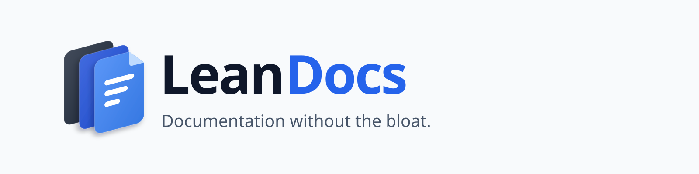

<picture>
  <source media="(prefers-color-scheme: dark)" srcset="branding/banners/readme-dark.svg">
  
</picture>

# LeanDocs

**Documentation without the bloat.**

LeanDocs is a lightweight, self-hosted documentation manager for technical people: homelabs, servers, networks, applications, runbooks.

- **Your files stay yours.** Every document is a plain Markdown file in a plain folder. Delete the app and your documentation is still there.
- **WYSIWYG when you want it, Markdown when you need it.** View → Edit → Visual / Source, all on the same `.md` file.
- **Fast search.** SQLite FTS5 index, rebuildable from the files at any time.
- **One container.** No Postgres, no Redis, no telemetry.

> **Status:** early development. The server can create, edit, rename, move and delete Markdown documents and folders (with a trash), and the browser UI lets you browse, read (rendered Markdown with tables, code, callouts, diagrams and links) and manage them. Both Visual and Source editors support autosave, local recovery drafts and attachment upload/paste/drop. Search and indexing (Phase 8) is next. See [`docs/implementation-status.md`](docs/implementation-status.md).

## Documentation

| Document                                                         | Purpose                                                     |
| ---------------------------------------------------------------- | ----------------------------------------------------------- |
| [`PROJECT_SPEC.md`](PROJECT_SPEC.md)                             | Product and architecture specification (what LeanDocs does) |
| [`UI_SPEC.md`](UI_SPEC.md)                                       | UI specification (how it looks and behaves)                 |
| [`AGENTS.md`](AGENTS.md)                                         | Rules and workflow for AI coding agents and contributors    |
| [`docs/implementation-status.md`](docs/implementation-status.md) | Current phase, task board, work log                         |
| [`docs/deployment.md`](docs/deployment.md)                       | Install, HTTPS reverse proxies, updates, backup and restore |
| [`docs/configuration.md`](docs/configuration.md)                 | Every setting, storage layout, HTTPS and sign-in modes      |
| [`docs/development.md`](docs/development.md)                     | Local development                                           |
| [`docs/adr/`](docs/adr/)                                         | Architecture decision records                               |

## Try it

```bash
mkdir -p data/content && cp -r examples/demo-content/. data/content/   # optional demo docs
docker compose -f compose_local_build.yaml up --build -d               # http://localhost:8080
```

`compose_local_build.yaml` builds the image from this repository. `compose.yaml` runs the published image (`ghcr.io/pbuzdygan/leandocs`) once releases exist.

For development with hot reload: `corepack enable && pnpm install && pnpm dev` (http://localhost:5173). Details are in [`docs/development.md`](docs/development.md).

## License

To be decided (see open questions in the status file).
