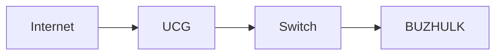

Dla nowego programu zostala wybrana nazwa i slogan:
LeanDocs
Documentation without the bloat.

Tak — po przejrzeniu aktualnego stanu tych trzech projektów uważam, że własne rozwiązanie ma u Ciebie sens, ale pod warunkiem, że świadomie nie zaczniesz budować „jeszcze jednego Notion/Trilium”. Twoja potrzeba jest znacznie węższa: szybkie tworzenie technicznej dokumentacji BUZLAB, przechowywanej w otwartych plikach i wygodnie edytowanej z przeglądarki.
Najlepszy kierunek widzę jako połączenie filozofii przechowywania Poznote + prostoty Jotty + tylko kilku elementów organizacyjnych Trilium.
Co faktycznie dają te trzy projekty
	Jotty	Poznote	Trilium
Podstawowe przeznaczenie	notatki + checklisty/tasks	notatki / dokumentacja	pełny Personal Knowledge Base
Treść	pliki .md	.md lub .html	głównie model danych aplikacji
Baza danych	nie	SQLite dla metadanych	SQLite jako fundamentalny element
WYSIWYG	TipTap	Rich Text dla HTML	CKEditor
Edycja Markdown	przez editor/konwersję	CodeMirror + preview	wsparcie Markdown w rich editorze
Foldery/drzewo	tak	tak	bardzo rozbudowane
Backlinks	tak	tak	bardzo rozbudowane
API	tak	bardzo rozbudowane	tak
Git	jest wsparcie Git	wbudowany Git Sync	import/export
Ciężar funkcjonalny	średni	średnio-duży	duży


Jotty jest już dziś dużo bardziej rozbudowane niż zwykły notes: ma checklisty, Kanban, time tracking, Excalidraw, graph/brain view, OIDC, MFA, REST API itd. Jednocześnie bardzo podoba mi się jego fundamentalny model: brak bazy danych dla treści; notatki są plikami Markdown, a pozostałe dane prostymi plikami JSON. Editor opiera się obecnie na TipTap 3. GitHub
Poznote jest jeszcze bliżej tego, czego szukasz. Rich-text przechowuje bezpośrednio jako .html, Markdown jako .md, zaś SQLite wykorzystuje do metadanych, tagów, relacji itd. Ma foldery, workspaces, backlinks, graph, attachmenty, snapshots, Git Sync, REST API, offline mode i sporo innych funkcji. GitHub
Trilium poszedł natomiast w zupełnie innym kierunku: hierarchia bez ograniczeń, klonowanie jednej notatki do wielu miejsc, attributes, relations, scripting, wiele typów notatek, mapy, versioning, desktop, mobile, standalone itd. Obecna architektura to już duży monorepo z backendem Node, Preactem, Electronem, SQLite, WebSocketami i kilkoma warstwami cache. To bardzo dobre narzędzie, ale dokładnie tłumaczy Twoje odczucie „za ciężkie”. GitHub
Co zbudowałbym dla BUZLAB
Moja podstawowa zasada byłaby taka:
Filesystem is the source of truth.

Nie SQLite. Nie wewnętrzny format aplikacji. Nie JSON ProseMirror.
Twoja dokumentacja powinna istnieć normalnie jako:
/data
└── documents
    ├── Infrastructure
    │   ├── BUZHULK.md
    │   ├── BUZPI00.md
    │   └── Synology.md
    │
    ├── Network
    │   ├── UniFi.md
    │   ├── VLAN.md
    │   └── DNS.md
    │
    ├── Applications
    │   ├── Home-Assistant.md
    │   ├── Vaultwarden.md
    │   ├── Filedeck.md
    │   └── Nginx-Proxy-Manager.md
    │
    ├── Procedures
    │   ├── Backup-Restore.md
    │   └── Docker-Recovery.md
    │
    └── _assets

Jeżeli jutro usuniesz aplikację, nadal masz całą dokumentację.
Możesz zrobić:
grep
ripgrep
git
rsync
restic
borg
cp

i wszystko nadal działa.
To jest dla mnie najważniejsza różnica między takim projektem a typowym PKM.
Jedna rzecz zmieniłbym względem Poznote
Początkowo nie robiłbym dwóch rodzajów notatek .html oraz .md.
Zrobiłbym:
Markdown
        ↓
WYSIWYG Markdown
        ↓
plik .md

I to może rozwiązać dokładnie problem, który opisałeś.
Obecnie istnieją edytory takie jak Milkdown, które są WYSIWYG Markdown: użytkownik widzi normalnie sformatowany dokument, ale źródłem pozostaje Markdown. Milkdown bazuje na ProseMirror + Remark i ma obsługę GFM, tabel, slash commands itd. Milkdown
Czyli zamiast pisać:
### Konfiguracja Docker

**Host:** BUZHULK

| parametr | wartość |
|---|---|
| OS | Ubuntu 24.04 |

mógłbyś po prostu pisać coś wyglądającego jak:
Konfiguracja Docker
Host: BUZHULK
i normalnie klikać bold, nagłówek, tabelę itd.
Ale plik na dysku nadal byłby czystym:
BUZHULK.md

To moim zdaniem idealnie trafia w problem, który opisujesz z Markdownem.
UI zrobiłbym w trzech stanach
To byłaby jedna z najważniejszych funkcji całej aplikacji.
VIEW
Normalnie aplikacja jest przeglądarką dokumentacji.
┌──────────────────────────────────────────────────────────┐
│ BUZHULK                                      ✎ Edit  ⋮   │
├──────────────────────────────────────────────────────────┤
│                                                          │
│  BUZHULK                                                 │
│                                                          │
│  Main Docker / Incus host                                │
│                                                          │
│  Hardware                                                │
│  • GMKTEC G3                                             │
│  • Intel N100                                            │
│  • Intel I226-V                                          │
│                                                          │
│  Docker                                                  │
│  ...                                                     │
│                                                          │
└──────────────────────────────────────────────────────────┘

Klikasz:
Edit
i dokument staje się edytowalny dokładnie w tym miejscu.
VISUAL EDIT
Domyślny sposób pisania:
B   I   H1   H2   •   1.   ☑   <>   🔗   📷   Table

Bez konieczności pamiętania Markdown.
SOURCE
Jednym przyciskiem:
Visual | Source

przechodzisz do:
# BUZHULK

Main Docker / Incus host

## Hardware

- GMKTEC G3
- Intel N100
- Intel I226-V

Source editor zrobiłbym na CodeMirror 6.
To byłby dla mnie fundament całej aplikacji:
VIEW → EDIT
         │
         ├── VISUAL
         │
         └── SOURCE

I właśnie tego rodzaju prosty przełącznik wydaje mi się dużo bardziej użyteczny niż dziesiątki funkcji Trilium.
Markdown pozostaje prawdziwym Markdownem
Nie robiłbym czegoś takiego:
Markdown
↓
ProseMirror JSON
↓
database
↓
eksport Markdown

bo wtedy Markdown tak naprawdę staje się tylko formatem eksportowym.
U Ciebie powinno być:
                 ┌── Visual editor
                 │
BUZHULK.md ──────┤
                 │
                 └── Source editor

Oba edytory pracują nad tym samym plikiem.
To bardzo istotna różnica.
A co z HTML?
Tutaj zrobiłbym kompromis.
Markdown pozwala osadzać HTML, więc dla szczególnych przypadków możesz mieć:
# Dashboard

<div class="info-box">
  <strong>BUZHULK</strong>
  <span>Production server</span>
</div>

Renderer może to obsłużyć.
Natomiast HTML trzeba oczywiście sanitizować przed renderowaniem.
Dzięki temu 95% dokumentacji zostaje czystym Markdownem, a HTML jest escape hatchem.
Dopiero gdyby po kilku miesiącach wyszło, że naprawdę często potrzebujesz pełnego HTML, dodałbym drugi typ:
Markdown Note
Rich Text Note

tak jak robi Poznote. Poznote przechowuje Rich Text właśnie jako standardowy HTML, więc nawet taki format pozostaje niezależny od aplikacji. GitHub
Metadane również powinny pozostać w pliku
Na przykład:
---
id: 8e54c837-a030-4ee7-b18a-c6a6ce1e193a
title: BUZHULK
tags:
  - server
  - docker
  - incus
icon: server
created: 2026-10-01
updated: 2026-10-02
---

Dalej:
# BUZHULK

Main container host...

To jest standardowy YAML front matter.
Dzięki temu nawet:
title
tags
created
updated
icon

nie są uwięzione w SQLite.
SQLite mimo wszystko bym zastosował
Ale wyłącznie jako:
CACHE / INDEX

czyli:
filesystem
    │
    ├── *.md
    ├── images
    └── attachments
          │
          ▼
      indexer
          │
          ▼
      SQLite FTS5

SQLite trzymałby:
note_id
path
title
tags
mtime
links
backlinks
search index

Dzięki temu wyszukiwanie tysiąca dokumentów jest natychmiastowe.
Jeżeli:
index.db

zniknie, aplikacja robi:
Rebuild index

i odtwarza wszystko z .md.
To jest zupełnie inna filozofia niż przechowywanie notatek w bazie.
Wyszukiwanie powinno być jedną z najmocniejszych funkcji
Chciałbym móc nacisnąć:
Ctrl + K

i wpisać:
macvlan

a aplikacja pokaże:
BUZHULK / Incus / Home Assistant
"...macvlan-shim@enp3s0..."

Network / Incus
"...macvlan host to guest communication..."

Troubleshooting / HAOS
"...macvlan prevented NPM..."

Nie tylko nazwy dokumentów.
SQLite FTS5 świetnie się tutaj nadaje.
Struktura aplikacji
Nie robiłbym Workspaces → Collections → Databases → Notes → Pages.
Dla BUZLAB wystarczy:
BUZLAB
│
├── Infrastructure
│   ├── Servers
│   │   ├── BUZHULK
│   │   ├── BUZPI00
│   │   └── Synology
│   │
│   └── UPS
│
├── Network
│   ├── UniFi
│   ├── VLAN
│   └── DNS
│
├── Applications
│   ├── Home Assistant
│   ├── Vaultwarden
│   └── NPM
│
└── Procedures

Folder na dysku = folder w aplikacji.
Przesuwasz dokument drag-and-drop:
Applications/Home-Assistant.md

→
Infrastructure/Home-Automation/Home-Assistant.md

To naprawdę jest zwykłe:
fs.rename()

Links i backlinks — tak, graph — niekoniecznie
Z Trilium i Poznote zabrałbym:
[[Home Assistant]]

Autocomplete:
[[Hom
   Home Assistant
   Homebridge
   Homepage

i po zapisaniu:
Links to this note
──────────────────
BUZHULK
Nginx Proxy Manager
Zigbee

Poznote już obsługuje wiki-links, backlinks oraz graph na bazie linków pomiędzy dokumentami. GitHub
Natomiast wizualny „knowledge graph” zrobiłbym co najwyżej kiedyś.
W praktycznej dokumentacji infrastruktury backlinks są użyteczne.
Latające kolorowe kulki po ekranie znacznie mniej.
Bardzo ważne: dokumentacja techniczna
Tutaj własny projekt może być lepszy niż wszystkie trzy narzędzia, bo można go świadomie zrobić pod IT.
W pierwszej wersji dałbym tylko:
- fenced code blocks + syntax highlighting + Copy;
- Mermaid;
- tabele;
- callouty Info / Warning / Danger / Note;
- drag&drop/paste screenshots;
- załączniki PDF/ZIP/config;
- automatyczny Table of Contents;
- linkowanie notatek i headingów;
- globalny search;
- optional templates dla Server, Service, Procedure, Network Device.
Na przykład:
:::warning
Nie włączać Secure Boot dla HAOS VM.
:::

renderowane jako elegancka karta.
Mermaid byłby bardzo wartościowy:
#chatgpt-mermaid-_r_1o5_{font-family:-apple-system-body,ui-sans-serif,-apple-system,system-ui,"Segoe UI",Helvetica,"Apple Color Emoji",Arial,sans-serif,"Segoe UI Emoji","Segoe UI Symbol";font-size:16px;fill:rgb(237, 237, 237);}@keyframes edge-animation-frame{from{stroke-dashoffset:0;}}@keyframes dash{to{stroke-dashoffset:0;}}#chatgpt-mermaid-_r_1o5_ .edge-animation-slow{stroke-dasharray:9,5!important;stroke-dashoffset:900;animation:dash 50s linear infinite;stroke-linecap:round;}#chatgpt-mermaid-_r_1o5_ .edge-animation-fast{stroke-dasharray:9,5!important;stroke-dashoffset:900;animation:dash 20s linear infinite;stroke-linecap:round;}#chatgpt-mermaid-_r_1o5_ .error-icon{fill:rgb(27, 27, 27);}#chatgpt-mermaid-_r_1o5_ .error-text{fill:rgb(237, 237, 237);stroke:rgb(237, 237, 237);}#chatgpt-mermaid-_r_1o5_ .edge-thickness-normal{stroke-width:1px;}#chatgpt-mermaid-_r_1o5_ .edge-thickness-thick{stroke-width:3.5px;}#chatgpt-mermaid-_r_1o5_ .edge-pattern-solid{stroke-dasharray:0;}#chatgpt-mermaid-_r_1o5_ .edge-thickness-invisible{stroke-width:0;fill:none;}#chatgpt-mermaid-_r_1o5_ .edge-pattern-dashed{stroke-dasharray:3;}#chatgpt-mermaid-_r_1o5_ .edge-pattern-dotted{stroke-dasharray:2;}#chatgpt-mermaid-_r_1o5_ .marker{fill:rgb(175, 175, 175);stroke:rgb(175, 175, 175);}#chatgpt-mermaid-_r_1o5_ .marker.cross{stroke:rgb(175, 175, 175);}#chatgpt-mermaid-_r_1o5_ svg{font-family:-apple-system-body,ui-sans-serif,-apple-system,system-ui,"Segoe UI",Helvetica,"Apple Color Emoji",Arial,sans-serif,"Segoe UI Emoji","Segoe UI Symbol";font-size:16px;}#chatgpt-mermaid-_r_1o5_ p{margin:0;}#chatgpt-mermaid-_r_1o5_ .label{font-family:-apple-system-body,ui-sans-serif,-apple-system,system-ui,"Segoe UI",Helvetica,"Apple Color Emoji",Arial,sans-serif,"Segoe UI Emoji","Segoe UI Symbol";color:rgb(237, 237, 237);}#chatgpt-mermaid-_r_1o5_ .cluster-label text{fill:rgb(237, 237, 237);}#chatgpt-mermaid-_r_1o5_ .cluster-label span{color:rgb(237, 237, 237);}#chatgpt-mermaid-_r_1o5_ .cluster-label span p{background-color:transparent;}#chatgpt-mermaid-_r_1o5_ .label text,#chatgpt-mermaid-_r_1o5_ span{fill:rgb(237, 237, 237);color:rgb(237, 237, 237);}#chatgpt-mermaid-_r_1o5_ .node rect,#chatgpt-mermaid-_r_1o5_ .node circle,#chatgpt-mermaid-_r_1o5_ .node ellipse,#chatgpt-mermaid-_r_1o5_ .node polygon,#chatgpt-mermaid-_r_1o5_ .node path{fill:rgb(9, 23, 44);stroke:rgb(31, 78, 148);stroke-width:1px;}#chatgpt-mermaid-_r_1o5_ .rough-node .label text,#chatgpt-mermaid-_r_1o5_ .node .label text,#chatgpt-mermaid-_r_1o5_ .image-shape .label,#chatgpt-mermaid-_r_1o5_ .icon-shape .label{text-anchor:middle;}#chatgpt-mermaid-_r_1o5_ .node .katex path{fill:#000;stroke:#000;stroke-width:1px;}#chatgpt-mermaid-_r_1o5_ .rough-node .label,#chatgpt-mermaid-_r_1o5_ .node .label,#chatgpt-mermaid-_r_1o5_ .image-shape .label,#chatgpt-mermaid-_r_1o5_ .icon-shape .label{text-align:center;}#chatgpt-mermaid-_r_1o5_ .node.clickable{cursor:pointer;}#chatgpt-mermaid-_r_1o5_ .root .anchor path{fill:rgb(175, 175, 175)!important;stroke-width:0;stroke:rgb(175, 175, 175);}#chatgpt-mermaid-_r_1o5_ .arrowheadPath{fill:rgb(175, 175, 175);}#chatgpt-mermaid-_r_1o5_ .edgePath .path{stroke:rgb(175, 175, 175);stroke-width:1px;}#chatgpt-mermaid-_r_1o5_ .flowchart-link{stroke:rgb(175, 175, 175);fill:none;}#chatgpt-mermaid-_r_1o5_ .edgeLabel{background-color:rgb(0, 0, 0);text-align:center;}#chatgpt-mermaid-_r_1o5_ .edgeLabel p{background-color:rgb(0, 0, 0);}#chatgpt-mermaid-_r_1o5_ .edgeLabel rect{opacity:0.5;background-color:rgb(0, 0, 0);fill:rgb(0, 0, 0);}#chatgpt-mermaid-_r_1o5_ .labelBkg{background-color:rgba(0, 0, 0, 0.5);}#chatgpt-mermaid-_r_1o5_ .cluster rect{fill:rgb(27, 27, 27);stroke:rgba(255, 255, 255, 0.15);stroke-width:1px;}#chatgpt-mermaid-_r_1o5_ .cluster text{fill:rgb(237, 237, 237);}#chatgpt-mermaid-_r_1o5_ .cluster span{color:rgb(237, 237, 237);}#chatgpt-mermaid-_r_1o5_ div.mermaidTooltip{position:absolute;text-align:center;max-width:200px;padding:2px;font-family:-apple-system-body,ui-sans-serif,-apple-system,system-ui,"Segoe UI",Helvetica,"Apple Color Emoji",Arial,sans-serif,"Segoe UI Emoji","Segoe UI Symbol";font-size:12px;background:rgb(27, 27, 27);border:1px solid rgba(255, 255, 255, 0.15);border-radius:2px;pointer-events:none;z-index:100;}#chatgpt-mermaid-_r_1o5_ .flowchartTitleText{text-anchor:middle;font-size:18px;fill:rgb(237, 237, 237);}#chatgpt-mermaid-_r_1o5_ rect.text{fill:none;stroke-width:0;}#chatgpt-mermaid-_r_1o5_ .icon-shape,#chatgpt-mermaid-_r_1o5_ .image-shape{background-color:rgb(0, 0, 0);text-align:center;}#chatgpt-mermaid-_r_1o5_ .icon-shape p,#chatgpt-mermaid-_r_1o5_ .image-shape p{background-color:rgb(0, 0, 0);padding:2px;}#chatgpt-mermaid-_r_1o5_ .icon-shape .label rect,#chatgpt-mermaid-_r_1o5_ .image-shape .label rect{opacity:0.5;background-color:rgb(0, 0, 0);fill:rgb(0, 0, 0);}#chatgpt-mermaid-_r_1o5_ .label-icon{display:inline-block;height:1em;overflow:visible;vertical-align:-0.125em;}#chatgpt-mermaid-_r_1o5_ .node .label-icon path{fill:currentColor;stroke:revert;stroke-width:revert;}#chatgpt-mermaid-_r_1o5_ .node .neo-node{stroke:rgb(31, 78, 148);}#chatgpt-mermaid-_r_1o5_ [data-look="neo"].node rect,#chatgpt-mermaid-_r_1o5_ [data-look="neo"].cluster rect,#chatgpt-mermaid-_r_1o5_ [data-look="neo"].node polygon{stroke:url(#chatgpt-mermaid-_r_1o5_-gradient);filter:drop-shadow( 1px 2px 2px rgba(185,185,185,1));}#chatgpt-mermaid-_r_1o5_ [data-look="neo"].swimlane.cluster rect{filter:none;}#chatgpt-mermaid-_r_1o5_ [data-look="neo"].node path{stroke:url(#chatgpt-mermaid-_r_1o5_-gradient);stroke-width:1px;}#chatgpt-mermaid-_r_1o5_ [data-look="neo"].node .outer-path{filter:drop-shadow( 1px 2px 2px rgba(185,185,185,1));}#chatgpt-mermaid-_r_1o5_ [data-look="neo"].node .neo-line path{stroke:rgb(31, 78, 148);filter:none;}#chatgpt-mermaid-_r_1o5_ [data-look="neo"].node circle{stroke:url(#chatgpt-mermaid-_r_1o5_-gradient);filter:drop-shadow( 1px 2px 2px rgba(185,185,185,1));}#chatgpt-mermaid-_r_1o5_ [data-look="neo"].node circle .state-start{fill:#000000;}#chatgpt-mermaid-_r_1o5_ [data-look="neo"].icon-shape .icon{fill:url(#chatgpt-mermaid-_r_1o5_-gradient);filter:drop-shadow( 1px 2px 2px rgba(185,185,185,1));}#chatgpt-mermaid-_r_1o5_ [data-look="neo"].icon-shape .icon-neo path{stroke:url(#chatgpt-mermaid-_r_1o5_-gradient);filter:drop-shadow( 1px 2px 2px rgba(185,185,185,1));}#chatgpt-mermaid-_r_1o5_ .node text{font-size:14px;font-weight:600;letter-spacing:normal;fill:rgb(153, 206, 255);}#chatgpt-mermaid-_r_1o5_ .edgeLabels text{font-size:13px;font-weight:600;letter-spacing:-0.08px;fill:rgb(153, 206, 255);}#chatgpt-mermaid-_r_1o5_ .node tspan[font-weight="normal"],#chatgpt-mermaid-_r_1o5_ .edgeLabels tspan[font-weight="normal"]{font-weight:600;}#chatgpt-mermaid-_r_1o5_ .edgeLabel .label rect{opacity:1;rx:13px;ry:13px;fill:rgb(0, 14, 26);stroke:rgb(26, 62, 95);stroke-width:1px;}#chatgpt-mermaid-_r_1o5_ .node rect,#chatgpt-mermaid-_r_1o5_ .node circle,#chatgpt-mermaid-_r_1o5_ .node ellipse,#chatgpt-mermaid-_r_1o5_ .node polygon,#chatgpt-mermaid-_r_1o5_ .node path{fill:rgb(0, 40, 77);stroke:rgba(255, 255, 255, 0.1);stroke-width:1px;}#chatgpt-mermaid-_r_1o5_ .node rect{rx:16px;ry:16px;}#chatgpt-mermaid-_r_1o5_ .node.mermaid-decision .label-container{fill:rgb(0, 14, 26);stroke:rgb(26, 62, 95);stroke-dasharray:2,2;}#chatgpt-mermaid-_r_1o5_ .edgePaths .flowchart-link{stroke:rgb(175, 175, 175);stroke-width:1px;stroke-linecap:round;stroke-linejoin:round;}#chatgpt-mermaid-_r_1o5_ .marker{fill:rgb(175, 175, 175);stroke:rgb(175, 175, 175);}#chatgpt-mermaid-_r_1o5_ :root{--mermaid-font-family:-apple-system-body,ui-sans-serif,-apple-system,system-ui,"Segoe UI",Helvetica,"Apple Color Emoji",Arial,sans-serif,"Segoe UI Emoji","Segoe UI Symbol";}InternetUCGUSWBUZHULKDockerIncus


Poznote i Trilium też wspierają Mermaid, więc jest to sprawdzony kierunek dla tego typu aplikacji. GitHub
Templates, ale bardzo lekkie
Nie robiłbym systemu workflow jak Obsidian.
Tylko:
+ New

Blank note
Server
Application
Procedure
Network device
Incident

Template Application:
# {{title}}

## Overview

## Deployment

## Configuration

## Network

## Volumes

## Backup

## Update procedure

## Troubleshooting

Po kliknięciu jest zwykły .md.
Jeżeli później template usuniesz, dokument pozostaje całkowicie normalny.
Historia wersji
Tu również nie wynajdywałbym koła.
Skoro wszystko jest plikami:
git

jest naturalnym systemem wersjonowania.
Aplikacja mogłaby sama zainicjalizować:
/data/documents/.git

i robić:
auto commit

np. po zakończeniu edycji dokumentu.
UI:
History

02 Oct 2026 01:48
Changed HAOS networking

01 Oct 2026 22:14
Added Incus configuration

28 Sep 2026 18:03
Initial document

Klikasz wersję → diff.
Poznote ma już synchronizację z GitHub/GitLab/Forgejo i potrafi pushować zmiany w notatkach, więc sam model został już dobrze przetestowany w podobnym rozwiązaniu. GitHub
U Ciebie dodatkowo mógłby działać z lokalnym Git/Forgejo, bez konieczności chmury.
Technologia
Ja dla takiego projektu wybrałbym:
Frontend
React
TypeScript
Vite
Tailwind

Editor
Milkdown / ProseMirror     ← Visual Markdown
CodeMirror 6               ← Source Markdown

Backend
Node.js
Fastify

Storage
Filesystem                ← CONTENT
SQLite + FTS5              ← INDEX

Markdown
remark / unified

Git
simple-git

Filesystem watcher
chokidar

i zrobił:
npm build
       ↓
frontend static files
       ↓
Fastify
       ↓
single Docker container

Compose:
services:
  docs:
    image: ghcr.io/...
    volumes:
      - ./data:/app/data
    ports:
      - 8080:8080

Bez:
Postgres
Redis
RabbitMQ
Elasticsearch
MinIO

Nie ma tutaj żadnej potrzeby.
Jak wyglądałaby architektura
                    Browser
                       │
                       ▼
                React frontend
                       │
               REST / WebSocket
                       │
                       ▼
                 Fastify API
                 /     |      \
                /      |       \
               ▼       ▼        ▼
          File API   Search    Git
              │       │         │
              ▼       ▼         ▼
         Markdown   SQLite    .git
           files     FTS5
              │
              ▼
         attachments

I najważniejsze:
SQLite DELETE
     ↓
documents still work

Application DELETE
     ↓
documents still work

Docker DELETE
     ↓
documents still work

To jest dla mnie definicja dobrego narzędzia dokumentacyjnego do homelabu.
Co świadomie wyrzuciłbym z MVP
Właśnie tutaj najłatwiej powtórzyć drogę Trilium czy nawet obecnego Poznote.
Nie dodawałbym Kanbana, task managera, kalendarza, journala, AI chat, knowledge graph, collaborative editing, multi-user permissions, reminders, baz danych w stylu Notion, whiteboardu, S3 storage ani systemu pluginów.
Poznote ma już dziś praktycznie cały ten ekosystem — API obejmuje m.in. tasks, reminders, sharing, graph, workspaces, backups, Git Sync itd. GitHub
I właśnie dlatego własne rozwiązanie powinno być mniejsze, a nie większe.
Jak potraktowałbym istniejące repozytoria
Nie forkowałbym Trilium.
Nie forkowałbym też Jotty.
Poznote jest bardziej interesujące, ponieważ jest na licencji MIT, więc można swobodnie korzystać z jego kodu, modyfikować go i włączać fragmenty do własnego projektu przy zachowaniu warunków licencji. GitHub
Dla porównania Jotty i Trilium są AGPL-3.0. GitHub
Mimo tego nie forkowałbym nawet Poznote. Ma już ponad 5700 commitów i ogromny zakres funkcjonalności. GitHub
Wziąłbym z niego pomysły architektoniczne, nie całą aplikację:
Poznote
    ↓
files + metadata DB

Jotty
    ↓
simple filesystem-first philosophy
    ↓
modern visual editor

Trilium
    ↓
hierarchical tree
    ↓
links/backlinks

i zbudował mały core od początku.
Mój docelowy koncept
Widzę to bardziej jako:
documentation browser/editor
niż:
note-taking application.
Czyli po otwarciu aplikacji:
┌──────────────────────────────────────────────────────────────┐
│ 🔎 Search documentation...                            ⚙     │
├───────────────┬──────────────────────────────────────────────┤
│               │                                              │
│ BUZLAB        │  BUZHULK                         Edit  ⋮      │
│               │                                              │
│ Infrastructure│  Main Docker and Incus host                  │
│  Servers      │                                              │
│   BUZHULK     │  ┌ Overview ─────────────────────────────┐   │
│   BUZPI00     │  │ Ubuntu Server 24.04                  │   │
│   Synology    │  │ Intel N100                           │   │
│               │  │ 32 GB RAM                            │   │
│ Network       │  └───────────────────────────────────────┘   │
│  UniFi        │                                              │
│  VLAN         │  Docker                                      │
│               │                                              │
│ Applications  │  ```yaml                                     │
│  HA           │  services:                                   │
│  Vaultwarden  │    ...                                       │
│  NPM          │  ```                                         │
│               │                                              │
│ Procedures    │                                              │
│               │                                              │
├───────────────┴──────────────────────────────────────────────┤
│ 🏷 docker  server  production       Updated 2 minutes ago    │
└──────────────────────────────────────────────────────────────┘

Czyli bardziej VS Code / GitBook / techniczne wiki, a mniej Notion.
I uważam, że tu jest faktyczna nisza dla Twojego rozwiązania: lekki self-hosted documentation manager, w którym Markdown jest prawdziwym formatem danych, ale użytkownik nie musi pisać Markdownu, jeśli nie chce.
Najbardziej charakterystyczną funkcją powinno być właśnie:
View → Edit → Visual / Source
plus:
filesystem = database.
To od razu odróżniłoby ten projekt zarówno od Poznote, jak i od Trilium.


    


przygotuj w takim razie pelen dokument takiego projektu ze wszystkimi fazami wdrozenia od poczaktu do konca - dokument posluzy mi do zbudowania projektu przez ai assitanta w vs code.
to bedzie jedno zadanie, po stworzeniu tego konceptu bedzie jeszcze drugi punkt przygotowani kilku propozycji mockup jak styylizacji/jak to ma wygladac i na bazie decyzji stworzyc opis wygladu UI.
a po stworzeniu tego kolejny krok to stworzenie nazwy
a po tym krokukolejny to stworzenie loga i baneru do akceptacji


 


Worked for 1m 34s


Poniżej jest Master Project Specification przygotowana tak, aby mogła zostać zapisana jako PROJECT_SPEC.md w repozytorium i stanowić nadrzędny dokument dla Codex/Claude Code w VS Code. Celowo używam roboczego <PROJECT_NAME> — nazwę ustalimy dopiero po zaakceptowaniu funkcji i UI.
Założenia technologiczne sprawdziłem względem aktualnej dokumentacji. Milkdown nadal jest headlessowym edytorem WYSIWYG Markdown opartym o ProseMirror/Remark, CodeMirror pozostaje właściwym wyborem dla source editora, Fastify ma aktualną linię 5.x, SQLite FTS5 zapewnia pełnotekstowy indeks, a Mermaid pozostaje aktywnie rozwijanym formatem diagramów tekstowych. Milkdown
<PROJECT_NAME>
Master Project Specification
Status: Initial Architecture / Product Specification
Wersja dokumentu: 0.1
Docelowe wydanie aplikacji: 1.0
Typ projektu: Self-hosted documentation manager / technical knowledge base
Główny przypadek użycia: dokumentacja infrastruktury IT, homelabu, aplikacji, procedur i konfiguracji
Model wdrożenia: Docker / pojedyncza instancja self-hosted
Podstawowa zasada: Filesystem is the source of truth

1. Cel dokumentu
Ten dokument jest nadrzędną specyfikacją projektu <PROJECT_NAME>.
Ma służyć jednocześnie jako:
- Product Requirements Document;
- Software Requirements Specification;
- opis architektury;
- plan implementacji;
- roadmapa;
- źródło zasad projektowych;
- źródło kryteriów akceptacji;
- instrukcja dla asystentów AI pracujących nad kodem;
- punkt odniesienia podczas podejmowania kolejnych decyzji.
Asystent AI implementujący projekt powinien traktować ten dokument jako źródło nadrzędne względem własnych założeń.
Jeżeli kod i dokument są ze sobą sprzeczne, należy ustalić przyczynę rozbieżności zamiast samodzielnie zmieniać architekturę projektu.

2. Problem, który aplikacja ma rozwiązać
Istniejące aplikacje do dokumentacji/notowania zwykle wpadają w jedną z dwóch kategorii.
Pierwsza to bardzo proste narzędzia Markdown, które zapewniają dużą przenośność danych, ale wymagają częstego ręcznego pisania składni Markdown.
Druga to rozbudowane systemy PKM/knowledge base, które zapewniają wygodny interfejs, ale:
- mają dużą liczbę funkcji niezwiązanych bezpośrednio z dokumentacją;
- narzucają własny model danych;
- zwiększają uzależnienie użytkownika od konkretnej aplikacji;
- przechowują dokumenty przede wszystkim w bazie danych;
- komplikują migrację;
- zwiększają wymagania infrastrukturalne;
- odciągają uwagę od podstawowej funkcji: tworzenia dokumentacji.
<PROJECT_NAME> ma wypełnić przestrzeń pomiędzy tymi podejściami.

3. Wizja produktu
Aplikacja ma być:
prostym, szybkim i nowoczesnym webowym systemem dokumentacji, w którym użytkownik może pisać tak wygodnie jak w edytorze WYSIWYG, ale jego dokumenty pozostają zwykłymi plikami Markdown.

Podstawowa zależność:
Filesystem
    ↓
Markdown files
    ↓
Application
    ├── View
    ├── Visual Edit
    ├── Source Edit
    ├── Search
    ├── Navigation
    └── Relationships
Aplikacja nie jest właścicielem dokumentacji.
Aplikacja jest interfejsem do dokumentacji.

4. Fundamentalne zasady projektu
4.1. Filesystem First
Kanonicznym źródłem dokumentu jest plik na filesystemie.
Przykład:
content/
├── Infrastructure/
│   ├── Servers/
│   │   ├── BUZHULK.md
│   │   └── BUZPI00.md
│   └── Storage/
│       └── Synology.md
├── Network/
│   ├── UniFi.md
│   ├── VLAN.md
│   └── DNS.md
└── Applications/
    ├── Home-Assistant.md
    └── Vaultwarden.md
Usunięcie aplikacji nie może powodować utraty możliwości korzystania z dokumentacji.
Dokument powinien być możliwy do otwarcia w:
- VS Code;
- Vim;
- Nano;
- Obsidian;
- Typora;
- GitHub;
- GitLab;
- dowolnym edytorze tekstowym obsługującym Markdown.

4.2. Markdown First
Podstawowym formatem dokumentów jest:
*.md
Nie należy przechowywać treści dokumentu jako:
- JSON ProseMirror;
- JSON TipTap;
- rekord SQLite;
- HTML generowany przez edytor;
- proprietary document format.
Stan edytora może być chwilowo reprezentowany wewnętrznie przez model ProseMirror, ale zapis końcowy musi zostać zserializowany do Markdown.

4.3. Database is not the content store
SQLite może przechowywać:
- indeks wyszukiwania;
- metadane pomocnicze;
- cache;
- informacje o linkach;
- backlinks;
- informacje o użytkowniku;
- ustawienia aplikacji;
- sesje;
- stan techniczny aplikacji.
SQLite nie może być jedynym miejscem przechowywania treści dokumentu.
Awaria lub usunięcie bazy danych nie może spowodować utraty dokumentacji.
Indeks dokumentów musi być możliwy do odbudowania na podstawie filesystemu.

5. Pozycjonowanie produktu
<PROJECT_NAME> nie powinien być projektowany jako:
- Notion replacement;
- Obsidian replacement;
- Trilium replacement;
- task manager;
- project manager;
- personal CRM;
- kalendarz;
- journal;
- whiteboard;
- kanban;
- database builder.
Powinien być projektowany jako:
documentation browser and editor

bardziej przypominający połączenie:
GitBook
+
VS Code Explorer
+
modern Markdown WYSIWYG editor
+
technical wiki
niż pełny system PKM.

6. Główny użytkownik
Pierwsza wersja jest projektowana przede wszystkim jako rozwiązanie:
single-user
self-hosted
technical documentation
Typowe zastosowania:
- dokumentacja homelabu;
- dokumentacja serwerów;
- dokumentacja sieci;
- dokumentacja Docker;
- procedury;
- runbooki;
- troubleshooting;
- dokumentacja aplikacji;
- dokumentacja konfiguracji;
- diagramy architektury;
- notatki techniczne;
- checklisty proceduralne;
- instrukcje recovery;
- dokumentacja zmian.
Architektura nie powinna uniemożliwiać obsługi wielu użytkowników w przyszłości, ale multi-user nie jest wymaganiem wersji 1.0.

7. Kluczowe doświadczenie użytkownika
Dokument posiada trzy główne stany.
VIEW
  ↓
EDIT
  ├── VISUAL
  └── SOURCE
VIEW
Domyślny tryb korzystania z dokumentacji.
Renderer wyświetla:
- nagłówki;
- tekst;
- listy;
- tabele;
- kod;
- diagramy;
- obrazy;
- załączniki;
- callouty;
- linki;
- spis treści.
Interfejs edytora nie powinien przeszkadzać podczas czytania.

VISUAL EDIT
Podstawowy tryb tworzenia dokumentów.
Użytkownik nie musi znać Markdown.
Powinien móc używać m.in.:
- bold;
- italic;
- headings;
- list;
- numbered list;
- checklist;
- blockquote;
- inline code;
- code block;
- link;
- image;
- table;
- horizontal separator;
- callout.
Visual Editor powinien pracować na modelu dokumentu, który można bezpiecznie przekształcić ponownie do Markdown.

SOURCE EDIT
Pełna edycja źródła Markdown.
Edytor powinien zapewniać:
- syntax highlighting;
- line numbers opcjonalnie;
- find;
- replace;
- undo;
- redo;
- tab handling;
- bracket handling;
- keyboard shortcuts.
Zmiana:
Visual → Source → Visual
nie może powodować niekontrolowanej utraty treści.

8. Kanoniczny format dokumentu
Przykładowy plik:
---
id: 77ce39fd-03cd-4d78-9e8f-87828449e0aa
title: BUZHULK
created: 2026-10-02T00:00:00Z
updated: 2026-10-02T00:00:00Z
tags:
  - server
  - docker
  - incus
aliases:
  - docker-host
icon: server
---

# BUZHULK

Main Docker and Incus host.

## Hardware

- GMKTEC G3
- Intel N100
- Intel I226-V

## Services

...

9. Front Matter
Należy wykorzystać YAML Front Matter.
Wymagane pola
id:
title:
created:
updated:
Opcjonalne pola
tags:
aliases:
icon:
template:
description:
Zasady
id:
- UUID;
- nie zmienia się przy zmianie nazwy;
- nie zmienia się po przeniesieniu dokumentu.
title:
- nazwa prezentowana użytkownikowi;
- nie musi być identyczna z nazwą pliku.
created:
- ustawiane przy tworzeniu dokumentu.
updated:
- aktualizowane przy zapisie.
tags:
- tablica stringów.
aliases:
- alternatywne nazwy pomocne przy wyszukiwaniu i linkowaniu.

10. Nazwy plików
Nazwy plików powinny być czytelne dla człowieka.
Przykład:
Home Assistant.md
Nginx Proxy Manager.md
BUZHULK.md
Docker Backup.md
Nie należy wymuszać nazw:
77ce39fd-03cd-4d78-9e8f-87828449e0aa.md
UUID znajduje się w front matter.
Należy sanitizować nazwy plików i blokować:
../
./
NUL
oraz inne próby path traversal.

11. Struktura katalogów
Struktura filesystemu jest jednocześnie strukturą nawigacji.
content/
├── Infrastructure/
├── Network/
├── Applications/
├── Procedures/
└── Troubleshooting/
Nie należy przechowywać struktury folderów wyłącznie w bazie danych.
Operacja drag & drop folderu lub dokumentu w UI powinna odpowiadać rzeczywistej operacji na filesystemie.

12. Foldery systemowe
W katalogu danych mogą istnieć katalogi zarezerwowane.
Proponowane:
content/
├── _templates/
├── _trash/
└── ...
Foldery systemowe nie są domyślnie pokazywane w głównym drzewie dokumentacji.

13. Załączniki
Preferowany model:
BUZHULK.md
BUZHULK.assets/
├── network.png
├── architecture.svg
└── compose.yaml
Zalety:
- dokument i jego pliki pozostają razem;
- łatwa migracja;
- łatwy backup;
- łatwe kopiowanie;
- brak globalnego magazynu blobów.
Przeniesienie dokumentu powinno automatycznie przenosić jego katalog .assets.
Zmiana nazwy dokumentu powinna odpowiednio zmienić nazwę katalogu .assets.

14. Obsługiwane załączniki
Minimum:
- PNG;
- JPEG;
- WEBP;
- SVG;
- PDF;
- TXT;
- YAML;
- JSON;
- ZIP.
Konfigurowalny limit pojedynczego pliku.
Domyślnie proponowane:
50 MB
Należy walidować:
- nazwę;
- rozszerzenie;
- MIME;
- wielkość.
Pliki wykonywalne powinny być domyślnie blokowane.

15. Drag & Drop / Clipboard
Użytkownik powinien móc:
wkleić screenshot
Ctrl + V
Aplikacja:
1. zapisuje obraz w <note>.assets;
2. generuje bezpieczną nazwę;
3. dodaje Markdown image link.
przeciągnąć plik
drag file → editor
Aplikacja:
1. uploaduje plik;
2. umieszcza go w assets;
3. tworzy link.

16. Markdown Profile
Projekt powinien korzystać z przewidywalnego podzbioru Markdown.
Wymagane:
- CommonMark;
- GitHub Flavored Markdown;
- tables;
- task lists;
- fenced code;
- autolinks;
- strikethrough.

17. Raw HTML
Raw HTML może być obsługiwany jako rozszerzenie.
Nie jest jednak podstawowym formatem dokumentów.
HTML:
- może znajdować się w pliku Markdown;
- musi być sanitizowany;
- nie może wykonywać JavaScript;
- nie może omijać zabezpieczeń aplikacji.
Visual editor nie musi umożliwiać wizualnej edycji dowolnego HTML.
Dla nieobsługiwanego bloku HTML może pokazywać reprezentację:
[HTML BLOCK]
Edycja takiego fragmentu odbywa się w Source Mode.

18. Callouts
Aplikacja powinna obsługiwać techniczne bloki informacyjne.
Preferowana składnia:


note
Informacja.
:::

```markdown
:::warning
Uwaga.
:::

:::danger
Operacja może spowodować utratę danych.
:::

Typy minimum:
note
info
tip
warning
danger

19. Code blocks
Kod jest funkcją pierwszej klasy.
Przykład:
```yaml
services:
  vaultwarden:
    image: vaultwarden/server
```

Renderer:
- syntax highlighting;
- copy button;
- zachowanie whitespace;
- language label.
Visual editor powinien umożliwiać utworzenie i edycję code block.
20. Mermaid
Aplikacja powinna renderować:


Renderowanie diagramu jest częścią View Mode.
Source pozostaje zwykłym tekstem Mermaid.
Błędny diagram nie może powodować awarii dokumentu.
Należy wyświetlić:
Diagram rendering error

oraz możliwość zobaczenia jego źródła.
21. Table of Contents
Dla dokumentu zawierającego nagłówki aplikacja powinna generować automatyczny TOC.
TOC:
- nie musi być zapisany do .md;
- generowany jest na podstawie AST dokumentu;
- linkuje do nagłówków;
- może być zwijany.
22. Links
Należy wspierać standardowe linki Markdown:
[BUZHULK](../Infrastructure/Servers/BUZHULK.md)

oraz wygodne wiki links:
[[BUZHULK]]

Wiki-link jest funkcją aplikacji.
Standardowy Markdown pozostaje formatem bardziej interoperacyjnym.
23. Link autocomplete
Po wpisaniu:
[[

Visual/Source editor może wyświetlić:
BUZHULK
BUZPI00
Home Assistant
Vaultwarden

Wyszukiwanie powinno uwzględniać:
- title;
- aliases;
- filename;
- path.
24. Backlinks
Aplikacja indeksuje linki pomiędzy dokumentami.
Dokument może posiadać panel:
Referenced by
─────────────
Home Assistant
Nginx Proxy Manager
Network Architecture

Backlink nie musi być zapisywany w źródłowym .md.
Jest informacją pochodną indeksu.
25. Broken links
Indexer powinien wykrywać linki prowadzące do nieistniejących dokumentów.
Aplikacja powinna umożliwiać przegląd:
Broken links

Na przykład:
Docker.md
→ ../Network/Old-VLAN.md
→ target not found

26. Rename i Move
Zmiana nazwy lub lokalizacji dokumentu nie powinna bez potrzeby niszczyć relacji.
Przy operacji:
Network/UniFi.md

→

Infrastructure/Network/UniFi.md

aplikacja powinna:
1. przenieść plik;
2. przenieść assets;
3. wykryć linki prowadzące do starego path;
4. zaktualizować linki zarządzane przez aplikację;
5. odświeżyć indeks.
Operacja musi być atomiczna na tyle, na ile pozwala filesystem.
27. External file changes
Użytkownik może zmienić dokument poza aplikacją.
Przykład:
VS Code
Git pull
rsync
script

Backend powinien monitorować filesystem.
Po zmianie:
file change
    ↓
filesystem watcher
    ↓
parse document
    ↓
update index
    ↓
notify frontend

Aplikacja nie może zakładać, że tylko ona modyfikuje pliki.
28. Konflikt edycji
Przy otwieraniu dokumentu frontend otrzymuje revision.
Revision może bazować na:
- mtime;
- hash;
- wersji generowanej przez backend.
Zapis zawiera:
expectedRevision

Jeżeli plik został wcześniej zmieniony:
409 Conflict

UI pokazuje:
This document changed outside the editor.

Review changes
Reload
Save as copy

Nie wolno automatycznie nadpisywać zmian.
29. Atomic Write
Zapisywanie dokumentu powinno używać schematu:
write temporary file
    ↓
fsync / flush where appropriate
    ↓
rename temporary → target

Celem jest ograniczenie ryzyka częściowo zapisanego dokumentu.
30. Search
Global search jest jedną z najważniejszych funkcji aplikacji.
Powinien indeksować:
- title;
- body;
- headings;
- tags;
- aliases;
- filename;
- path.
Przykład:
Ctrl + K

macvlan

wynik:
Home Assistant
...macvlan-shim used for host communication...

BUZHULK
...Incus VM uses macvlan...

Troubleshooting
...NPM 502 caused by macvlan...

31. SQLite FTS
Do full-text search należy wykorzystać SQLite FTS5.
Indeks jest pochodny.
Musi istnieć funkcja:
Rebuild Search Index

która:
1. usuwa stary indeks;
2. skanuje wszystkie dokumenty;
3. parsuje frontmatter;
4. parsuje treść;
5. odbudowuje dokumenty;
6. odbudowuje relacje;
7. odbudowuje FTS.
32. Ranking wyszukiwania
Wyniki powinny preferować:
1. exact title;
2. title prefix;
3. alias;
4. tag;
5. heading;
6. body.
Powinny również pokazywać fragment dokumentu zawierający znalezioną frazę.
33. Search filters
Docelowo:
tag:docker
path:Infrastructure
title:BUZHULK

Możliwa składnia:
docker tag:server

Zaawansowane filtry nie muszą blokować MVP.
34. Quick Open
Niezależnie od pełnego wyszukiwania należy zapewnić szybkie otwieranie dokumentu.
Przykład:
Ctrl + P

i wyszukiwanie po:
- title;
- filename;
- aliases;
- path.
35. Templates
Templates również są zwykłymi plikami Markdown.
Przykład:
_templates/
├── Server.md
├── Application.md
├── Procedure.md
├── Network Device.md
└── Incident.md

36. Przykład template — Server
# {{title}}

## Overview

## Hardware

## Operating System

## Network

## Storage

## Services

## Backup

## Monitoring

## Maintenance

## Troubleshooting

## References

37. Tworzenie dokumentu
Dialog:
New Document

Name:
Location:
Template:

[ Blank ]
[ Server ]
[ Application ]
[ Procedure ]
[ Network Device ]

Po zatwierdzeniu:
1. utworzenie UUID;
2. wygenerowanie front matter;
3. utworzenie .md;
4. otwarcie w Visual Edit.
38. Usuwanie dokumentu
W wersji 1.0 nie należy od razu wykonywać permanentnego delete.
Usunięty dokument trafia do:
_trash/

z zachowaniem metadanych pozwalających na restore.
UI powinno zapewniać:
Trash
Restore
Delete permanently
Empty trash

39. Dashboard / Home
Home nie powinien stawać się rozbudowanym dashboardem analitycznym.
Minimum:
Recent documents
Recently updated
Pinned documents
Quick actions

Przykład:
New Document
Search
Open recent

40. Favorites / Pins
Użytkownik może przypiąć dokument.
Pin jest metadaną aplikacji i nie musi modyfikować .md.
Przypięte dokumenty są dostępne w sidebarze.
41. Tags
Tags przechowywane są w front matter.
UI powinno umożliwiać:
- przypisywanie;
- usuwanie;
- autocomplete;
- filtrowanie.
Tag nie powinien być osobnym obiektem wymagającym zarządzania w bazie.
Lista tagów może być generowana z dokumentów.
42. Navigation Tree
Tree jest generowane z filesystemu.
Funkcje:
- expand;
- collapse;
- folder create;
- folder rename;
- folder move;
- note create;
- note rename;
- note move;
- context menu;
- drag and drop.
Stan expanded/collapsed może być przechowywany jako ustawienie użytkownika.
43. Funkcjonalny układ aplikacji
Stylistyka UI nie jest definiowana w tym dokumencie.
Docelowy layout funkcjonalny:
┌───────────────────────────────────────────────────────┐
│ Header / Search / Actions                             │
├─────────────┬──────────────────────────┬──────────────┤
│             │                          │              │
│ Navigation  │ Document                 │ Context      │
│ Tree        │ View / Editor            │ optional     │
│             │                          │              │
└─────────────┴──────────────────────────┴──────────────┘

Panel Context może zawierać:
- TOC;
- properties;
- backlinks;
- document information.
Powinien być opcjonalny.
44. Responsive behavior
Desktop jest główną platformą.
Tablet i telefon muszą nadal pozwalać na:
- wyszukiwanie;
- czytanie;
- podstawową edycję;
- tworzenie dokumentów.
Na małym ekranie navigation tree może działać jako drawer.
Nie należy próbować zachować trzech kolumn na telefonie.
45. Keyboard Shortcuts
Minimum:
Ctrl/Cmd + K     global search
Ctrl/Cmd + P     quick open
Ctrl/Cmd + S     save
Ctrl/Cmd + B     bold
Ctrl/Cmd + I     italic
Ctrl/Cmd + Z     undo
Ctrl/Cmd + Shift + Z redo
Esc              exit dialog

Docelowo:
Ctrl/Cmd + E

może przełączać View/Edit.
46. Autosave
Preferowany model:
editing
↓
local editor state
↓
debounce
↓
save

Jednocześnie przycisk Save powinien pozostać dostępny.
Stan powinien być widoczny:
Saved
Saving…
Unsaved
Conflict
Error

Autosave nie może ukrywać błędów.
47. Unsaved recovery
Frontend powinien lokalnie zachowywać niezatwierdzony draft podczas awarii przeglądarki.
Po ponownym otwarciu:
Unsaved local changes found

Restore
Discard

Local draft nie zastępuje dokumentu na serwerze automatycznie.
48. Authentication
Wersja 1.0 jest single-user.
Obsługiwane tryby:
AUTH_MODE=local
AUTH_MODE=proxy
AUTH_MODE=none

Domyślnie:
local

49. Local authentication
Pierwsze uruchomienie:
Create administrator account

Przechowywanie:
- salted password hash;
- brak plaintext password;
- bezpieczna sesja cookie.
Cookie:
HttpOnly
SameSite
Secure when HTTPS

50. Proxy authentication
Tryb:
AUTH_MODE=proxy

jest przeznaczony do działania za zaufanym reverse proxy/auth gateway.
Nie może ufać dowolnym nagłówkom z Internetu.
Mechanizm musi posiadać konfigurację trusted proxy.
51. No authentication
AUTH_MODE=none

dozwolony tylko jako świadoma konfiguracja użytkownika.
UI powinno pokazywać ostrzeżenie w ustawieniach.
52. Security
Należy od początku uwzględnić:
- path traversal prevention;
- XSS protection;
- HTML sanitization;
- CSRF protection;
- secure sessions;
- upload validation;
- size limits;
- MIME validation;
- safe Markdown rendering;
- safe Mermaid rendering;
- content security policy;
- security headers;
- rate limiting login;
- safe filename handling.
53. Telemetry
Domyślnie:
NO TELEMETRY

Aplikacja nie wysyła danych użytkownika ani informacji o dokumentach do usług zewnętrznych.
Nie należy integrować trackerów.
54. Architektura
Docelowo:
                    Browser
                       │
                       ▼
                 React Frontend
                       │
                    REST API
                       │
                       ▼
                 Fastify Backend
           ┌───────────┼────────────┐
           │           │            │
           ▼           ▼            ▼
       Filesystem    SQLite       Watcher
           │           │            │
           ▼           ▼            ▼
       Markdown      FTS5        Reindex
       Assets        metadata

55. Technology Stack
Language
TypeScript

dla frontendu i backendu.
Frontend
React
TypeScript
Vite

Biblioteka stylizacji zostanie ostatecznie potwierdzona podczas etapu UI.
Architektura nie powinna uzależniać logiki aplikacji od biblioteki komponentów.
Visual Markdown Editor
Preferowany:
Milkdown

Wykorzystywany jako headless WYSIWYG Markdown editor.
Nie należy przechowywać ProseMirror state jako kanonicznego dokumentu.
Source Editor
CodeMirror 6

Backend
Node.js LTS
Fastify
TypeScript

Database
SQLite
FTS5

Preferowany binding:
better-sqlite3

Jeżeli podczas implementacji pojawi się stabilniejsza standardowa alternatywa w docelowej wersji Node LTS, zmiana wymaga świadomej decyzji architektonicznej, a nie przypadkowej podmiany przez AI.
Filesystem watcher
Preferowany:
chokidar

lub odpowiednik zapewniający stabilne cross-platform file watching.
Markdown processing
Ekosystem:
unified
remark
rehype

Diagram rendering
Mermaid

56. Monorepo
Preferowana struktura:
/
├── apps/
│   ├── web/
│   └── server/
│
├── packages/
│   └── shared/
│
├── docs/
│
├── docker/
│
├── PROJECT_SPEC.md
├── README.md
├── package.json
├── pnpm-workspace.yaml
└── compose.yaml

Package manager:
pnpm

57. Backend modules
Proponowana struktura:
server/src/
├── auth/
├── config/
├── documents/
├── filesystem/
├── indexer/
├── search/
├── links/
├── attachments/
├── templates/
├── trash/
├── settings/
├── watcher/
└── api/

Moduły powinny być rozdzielone odpowiedzialnościami.
Route handler nie powinien bezpośrednio zawierać całej logiki filesystemu.
58. Frontend modules
web/src/
├── app/
├── api/
├── components/
├── editor/
│   ├── visual/
│   └── source/
├── documents/
├── navigation/
├── search/
├── settings/
├── hooks/
└── utils/

Dokładna biblioteka UI zostanie określona po przygotowaniu mockupów.
59. API conventions
Base:
/api/v1

JSON.
Standardowa odpowiedź błędu:
{
  "error": {
    "code": "DOCUMENT_CONFLICT",
    "message": "Document has changed",
    "details": {}
  }
}

60. Minimal API
Health
GET /api/v1/health

Authentication
POST /api/v1/auth/login
POST /api/v1/auth/logout
GET  /api/v1/auth/session

Tree
GET /api/v1/tree

Documents
GET    /api/v1/documents/:id
POST   /api/v1/documents
PUT    /api/v1/documents/:id
DELETE /api/v1/documents/:id

Document operations
POST /api/v1/documents/:id/move
POST /api/v1/documents/:id/rename
POST /api/v1/documents/:id/restore

Search
GET /api/v1/search?q=

Links
GET /api/v1/documents/:id/links
GET /api/v1/documents/:id/backlinks

Attachments
POST   /api/v1/documents/:id/attachments
DELETE /api/v1/documents/:id/attachments/:filename

Index
POST /api/v1/index/rebuild
GET  /api/v1/index/status

Templates
GET /api/v1/templates

61. Document DTO
Przykładowa odpowiedź:
{
  "id": "77ce39fd-03cd-4d78-9e8f-87828449e0aa",
  "title": "BUZHULK",
  "path": "Infrastructure/Servers/BUZHULK.md",
  "content": "# BUZHULK...",
  "frontmatter": {
    "tags": ["server", "docker"]
  },
  "revision": "sha256:...",
  "created": "...",
  "updated": "..."
}

62. Index lifecycle
Startup:
start
 ↓
open database
 ↓
verify schema
 ↓
load filesystem
 ↓
compare index
 ↓
incremental update
 ↓
start watcher
 ↓
ready

Pełny rebuild nie powinien być wymagany przy każdym restarcie.
63. Database schema — koncepcyjnie
Tabela:
documents

pola:
id
path
filename
title
description
created_at
updated_at
mtime
content_hash

Tabela:
tags

Tabela:
document_tags

Tabela:
links

Tabela FTS:
documents_fts

Tabela systemowa:
settings

Tabela auth:
users
sessions

Treść dokumentu może występować w FTS jako indeks pochodny, ale źródłem treści nadal pozostaje .md.
64. Parser pipeline
Markdown File
     ↓
Frontmatter Parser
     ↓
Markdown Parser
     ↓
AST
 ┌───┼────┬─────────┐
 ↓   ↓    ↓         ↓
TOC Links Tags   Search text

Parser powinien być wspólną warstwą dla:
- renderer;
- backlinks;
- search;
- TOC;
- validation.
65. Renderer
Renderer nie powinien wykonywać niebezpiecznego HTML.
Pipeline:
Markdown
↓
AST
↓
plugins
↓
sanitization
↓
React / HTML rendering

66. Import / Migration
Projekt powinien od początku pozostawić miejsce dla importerów.
Interfejs logiczny:
Importer
  detect()
  scan()
  preview()
  convert()
  import()

67. Import Markdown directory
Pierwszy importer:
Generic Markdown Directory

Powinien:
- zachować strukturę folderów;
- zachować .md;
- wykryć istniejący front matter;
- dodać brakujący UUID;
- nie niszczyć istniejących informacji.
68. Import HTML
HTML importer:
.html
 ↓
HTML parser
 ↓
Markdown conversion
 ↓
review report

Import musi generować raport elementów, których nie udało się bezpiecznie przekształcić.
Oryginalnego pliku nie należy usuwać podczas importu.
69. Migracja z Poznote
Docelowo importer powinien wspierać:
- .md;
- .html;
- strukturę folderów;
- załączniki.
Nie należy uzależniać core aplikacji od formatu Poznote.
Importer jest osobnym adapterem.
70. Migracja z Obsidian
Powinna być stosunkowo prosta:
vault
→ markdown directory import

Należy zachować:
- foldery;
- Markdown;
- attachments;
- wiki-links tam, gdzie to możliwe.
71. Migracja z Jotty
Jeżeli dokumenty są już plikami Markdown, importer powinien przede wszystkim:
- zachować pliki;
- dodać brakujące IDs;
- przeindeksować dokumenty.
72. Git integration — etap rozszerzony
Core aplikacji nie wymaga Git do działania.
Git będzie opcjonalną funkcją.
Możliwości:
Initialize repository
Commit
History
Diff
Restore version

Opcjonalnie:
auto-commit

73. Zasada Git
Git nie może być wymagany do:
- uruchomienia aplikacji;
- edycji dokumentów;
- wyszukiwania;
- backupu.
Jest dodatkową warstwą historii.
74. Backup
Najważniejszym katalogiem do backupu jest:
/data/content

Backup aplikacji nie powinien wymagać specjalistycznego exportera.
Wystarczające powinno być:
rsync
restic
borg
snapshot
tar

SQLite powinien również być backupowany, ale jego utrata nie oznacza utraty dokumentów.
75. Restore
Po odtworzeniu samego:
content/

aplikacja powinna potrafić:
Rebuild

i wrócić do działania.
To jest jedno z kryteriów akceptacji architektury.
76. Docker deployment
Docelowo pojedynczy kontener aplikacji.
Przykład logiczny:
services:
  app:
    image: ghcr.io/<owner>/<project>:latest

    volumes:
      - ./data:/data

    ports:
      - "8080:8080"

    restart: unless-stopped

Bez wymaganych usług:
PostgreSQL
Redis
RabbitMQ
Elasticsearch
MinIO

77. Container filesystem
Przykład:
/data/
├── content/
└── system/
    └── app.db

Aplikacja nie może zapisywać istotnych danych tylko w ephemeral filesystem kontenera.
78. Configuration
Konfiguracja przez environment variables.
Minimum:
PORT
DATA_DIR
AUTH_MODE
LOG_LEVEL
MAX_UPLOAD_SIZE

Sekrety nie powinny być zapisywane do repozytorium.
79. Reverse Proxy
Aplikacja powinna poprawnie działać za:
- Nginx;
- Nginx Proxy Manager;
- Traefik;
- Caddy.
Musi poprawnie obsługiwać:
- forwarded headers;
- HTTPS termination;
- websocket/SSE jeśli zostaną wykorzystane.
Nie należy hardkodować hostname.
80. Base Path
Jeżeli architektura na to pozwoli, dobrze przewidzieć konfigurację:
BASE_PATH

ale nie jest to wymóg blokujący MVP.
81. Logs
Backend powinien stosować structured logging.
Minimum:
timestamp
level
message
module
requestId

Nie logować:
- passwords;
- session tokens;
- pełnych dokumentów;
- sekretów.
82. Health checks
Endpoint:
GET /api/v1/health

powinien raportować:
{
  "status": "ok"
}

Docker może używać go jako healthcheck.
83. Error handling
Użytkownik nie powinien otrzymywać raw stack traces.
Frontend pokazuje komunikat zrozumiały dla użytkownika.
Backend loguje szczegóły.
84. Performance targets
Projekt nie wymaga optymalizacji pod miliony dokumentów.
Docelowy rozsądny zakres:
10 000 dokumentów

powinien pozostawać wygodny.
Typowy deployment:
100–3000 dokumentów

Search powinien zwracać wynik praktycznie natychmiast.
Tree nie powinno wymagać wczytywania treści wszystkich dokumentów.
85. Caching
Nie wprowadzać Redis.
Do cache wystarczają:
- pamięć procesu;
- SQLite;
- browser cache.
86. Testing strategy
Projekt musi posiadać testy od początku.
Warstwy:
unit
integration
e2e

87. Unit tests
Minimum dla:
- front matter parser;
- path sanitizer;
- filename sanitizer;
- Markdown parser;
- link parser;
- wiki-link resolver;
- rename logic;
- move logic;
- revision calculation;
- search query parser.
88. Integration tests
Testować prawdziwy tymczasowy filesystem.
Scenariusze:
create note
read note
update note
move note
rename note
delete note
restore note
external change
conflict
reindex
attachment upload

89. API tests
Fastify API powinno być testowane bez uruchamiania zewnętrznego serwera tam, gdzie framework umożliwia request injection.
90. Frontend tests
Minimum:
- navigation tree;
- search;
- document opening;
- editor state;
- conflict dialog;
- save status.
91. E2E
Preferowany:
Playwright

Najważniejsze scenariusze:
E2E-01
login
→ create document
→ edit
→ save
→ refresh
→ document exists

E2E-02
create folder
→ move note
→ refresh
→ tree preserved

E2E-03
upload image
→ image rendered
→ asset exists

E2E-04
search phrase
→ correct document returned

E2E-05
external file modification
→ app detects change

92. Quality gates
Każdy merge do głównej gałęzi powinien przechodzić:
lint
typecheck
unit tests
integration tests
build

E2E można wykonywać w rozszerzonym pipeline.
93. CI/CD
GitHub Actions lub zgodny pipeline.
Proces:
push
 ↓
install
 ↓
lint
 ↓
typecheck
 ↓
test
 ↓
build

Dla tagu release:
build Docker image
↓
push GHCR

94. Docker tags
Proponowane:
latest
1
1.0
1.0.0
sha-xxxx

95. Dokumentacja repozytorium
Repo powinno posiadać:
README.md
PROJECT_SPEC.md
CONTRIBUTING.md
CHANGELOG.md
SECURITY.md
LICENSE

oraz:
docs/
├── architecture.md
├── development.md
├── deployment.md
├── configuration.md
├── markdown.md
└── implementation-status.md

96. implementation-status.md
Ten plik jest szczególnie ważny przy pracy wielu asystentów AI.
Powinien zawierać:
Current Phase
Completed
In Progress
Known Issues
Technical Decisions
Next Tasks

AI powinno aktualizować go po każdym większym etapie.
97. Architecture Decision Records
Dla znaczących zmian stosować:
docs/adr/

Przykład:
0001-filesystem-as-source-of-truth.md
0002-markdown-canonical-format.md
0003-sqlite-search-index.md

ADR nie jest wymagany dla drobnych decyzji.
98. Development philosophy
Najważniejsza zasada:
Do not build functionality before it is needed.

Preferować:
simple
explicit
portable
testable
maintainable

nad:
clever
generic
enterprise
abstract
future-proof-at-all-costs

99. Funkcje świadomie poza wersją 1.0
Nie implementować w pierwszej wersji:
- multi-user collaboration;
- realtime collaborative editing;
- Kanban;
- calendar;
- reminders;
- time tracking;
- whiteboard;
- database views;
- spreadsheet;
- knowledge graph visualization;
- AI assistant;
- vector database;
- embeddings;
- chat with documents;
- plugin marketplace;
- email integration;
- mobile native application;
- S3 storage;
- WebDAV;
- automatic cloud sync;
- public publishing platform.
Brak tych funkcji jest świadomą decyzją produktową, a nie brakiem projektu.
100. Roadmapa implementacji
Projekt należy budować etapami.
Każda faza posiada:
- Scope;
- Deliverables;
- Acceptance Criteria;
- Gate.
AI nie powinno implementować kilku dużych faz jednocześnie.
PHASE 0 — Repository Bootstrap
Cel
Utworzenie stabilnej podstawy developmentu.
Zadania
1. Utworzyć repozytorium.
2. Skonfigurować pnpm workspace.
3. Utworzyć:
apps/web
apps/server
packages/shared

4. Skonfigurować TypeScript.
5. Skonfigurować lint.
6. Skonfigurować formatter.
7. Skonfigurować test runner.
8. Utworzyć minimalny Fastify server.
9. Utworzyć minimalny React frontend.
10. Dodać /api/v1/health.
11. Skonfigurować development scripts.
12. Utworzyć Dockerfile development/build.
13. Dodać podstawowy CI.
Acceptance Criteria
pnpm install
pnpm dev
pnpm build
pnpm test
pnpm lint

działają.
Frontend komunikuje się z backendem.
Health endpoint działa.
Gate
Nie rozpoczynać funkcji dokumentów, jeżeli build/test/lint nie są stabilne.
PHASE 1 — Filesystem Core
Cel
Zbudowanie najważniejszej warstwy projektu.
Zakres
Implementacja:
- Data Directory;
- content directory;
- folder scanning;
- note discovery;
- frontmatter parser;
- stable UUID;
- safe path handling.
Funkcje
scan content
list tree
read note
create note
update note

Jeszcze bez zaawansowanego UI.
Testy
Muszą obejmować:
- empty directory;
- nested folders;
- invalid Markdown;
- missing frontmatter;
- duplicate ID;
- unsafe paths.
Acceptance Criteria
Można ręcznie stworzyć:
/data/content/Test.md

i backend wykrywa dokument.
Dokument można pobrać API.
Treść znajduje się fizycznie w .md.
PHASE 2 — Document CRUD
Cel
Pełne zarządzanie dokumentem.
Implementacja
- create;
- read;
- update;
- rename;
- move;
- trash;
- restore;
- permanent delete.
Dodatkowo
- atomic writes;
- revision;
- conflict detection.
Acceptance Criteria
Cały lifecycle dokumentu działa z poziomu API.
Po każdej operacji filesystem odpowiada stanowi aplikacji.
Nie istnieje sytuacja, w której dokument widoczny jest wyłącznie w SQLite.
PHASE 3 — Navigation UI
Cel
Pierwszy rzeczywiście używalny frontend.
Implementacja
- app shell;
- navigation tree;
- document view;
- folder expansion;
- create document;
- rename;
- move;
- delete;
- context menus;
- recent documents.
Stylistyka ma być funkcjonalna i tymczasowa.
Nie należy na tym etapie inwestować czasu w finalny design.
Acceptance Criteria
Użytkownik może zarządzać całą strukturą dokumentacji z przeglądarki.
PHASE 4 — Markdown Rendering
Cel
Pełne czytanie dokumentacji.
Obsługa
- headings;
- paragraphs;
- links;
- images;
- tables;
- lists;
- task lists;
- blockquote;
- inline code;
- code fences;
- syntax highlighting;
- TOC.
Następnie:
- callouts;
- Mermaid.
Acceptance Criteria
Typowy techniczny plik Markdown renderuje się poprawnie.
Niebezpieczny HTML nie wykonuje kodu.
PHASE 5 — Source Editor
Cel
Pełna edycja Markdown.
Implementacja CodeMirror.
Funkcje:
- open;
- edit;
- save;
- autosave;
- dirty state;
- shortcuts;
- conflict handling.
Acceptance Criteria
Można używać aplikacji jako kompletnego Markdown documentation managera nawet bez Visual Editor.
Jest to pierwszy functional milestone.
PHASE 6 — Visual Editor
Cel
Usunięcie konieczności ręcznego pisania Markdown.
Implementacja Milkdown.
Obsługa minimum:
- headings;
- bold;
- italic;
- lists;
- numbered lists;
- task lists;
- blockquotes;
- code;
- code blocks;
- links;
- images;
- tables.
Najważniejszy test
Dokument:
Source
→ Visual
→ modify
→ Source

nie może utracić semantycznie istotnych elementów.
Acceptance Criteria
Użytkownik może stworzyć typową dokumentację techniczną bez ręcznego pisania Markdown.
PHASE 7 — Attachments
Cel
Kompletna dokumentacja techniczna z obrazami i plikami.
Implementacja:
- upload;
- clipboard image;
- drag & drop;
- image rendering;
- generic attachments;
- delete;
- asset migration on move;
- validation.
Acceptance Criteria
Screenshot można wkleić:
Ctrl+V

i po zapisaniu istnieje jako zwykły plik w assets.
PHASE 8 — Search & Indexing
Cel
Bardzo szybkie odnajdywanie informacji.
Implementacja:
- SQLite schema;
- FTS5;
- indexer;
- incremental indexing;
- rebuild;
- search UI;
- Ctrl+K;
- snippets;
- ranking.
Acceptance Criteria
Zmiana dokumentu aktualizuje wyniki wyszukiwania.
Usunięcie app.db + rebuild przywraca pełny search.
PHASE 9 — Links & Backlinks
Cel
Utworzenie lekkiego knowledge graph bez wizualnego graph view.
Implementacja:
- Markdown links;
- wiki links;
- autocomplete;
- link resolver;
- backlinks;
- broken links;
- link update podczas move/rename.
Acceptance Criteria
Dokument może odwołać się do innego dokumentu i relacja jest widoczna z obu stron.
PHASE 10 — Templates, Tags, Properties
Implementacja
Templates:
Blank
Server
Application
Procedure
Network Device
Incident

Tags:
- add;
- remove;
- autocomplete;
- filter.
Properties panel:
- title;
- path;
- created;
- updated;
- tags;
- aliases.
Acceptance Criteria
Tworzenie typowej dokumentacji infrastruktury wymaga minimalnej ilości powtarzalnej pracy.
PHASE 11 — Authentication & Hardening
Implementacja
- first run;
- local account;
- sessions;
- logout;
- proxy mode;
- none mode;
- security headers;
- rate limit;
- CSRF;
- sanitization;
- security review.
Acceptance Criteria
Aplikację można bezpiecznie wystawić przez HTTPS za reverse proxy.
PHASE 12 — File Watcher & External Changes
Implementacja
- filesystem watcher;
- incremental reindex;
- frontend notification;
- conflict handling.
Testować:
application open
↓
edit same Markdown in VS Code
↓
application detects update

Acceptance Criteria
Filesystem naprawdę pozostaje źródłem prawdy również wtedy, kiedy pliki są zmieniane poza aplikacją.
PHASE 13 — Import / Migration
Implementacja
Generic Markdown
Najwyższy priorytet.
HTML
Konwersja z raportem.
Obsidian
Na bazie Markdown importer.
Poznote
Specyficzny adapter jeśli okaże się potrzebny.
Acceptance Criteria
Istniejącą bibliotekę Markdown można zaimportować bez ręcznego kopiowania każdego dokumentu.
PHASE 14 — Deployment
Implementacja
- production Dockerfile;
- compose.yaml;
- healthcheck;
- persistent volume;
- environment configuration;
- reverse proxy documentation;
- migration strategy DB;
- version reporting.
Acceptance Criteria
Uruchomienie:
docker compose up -d

wystarcza do działania aplikacji.
PHASE 15 — Release Hardening
Cel
Przygotowanie 1.0.
Zadania
- dependency audit;
- security review;
- filesystem corruption tests;
- upgrade tests;
- backup/restore tests;
- migration tests;
- performance tests;
- accessibility review;
- browser testing;
- documentation review.
PHASE 16 — UI Finalization
Ta faza zostanie dokładnie zdefiniowana po ukończeniu oddzielnego procesu projektowego:
mockups
↓
wybór kierunku
↓
pełny UI specification

Master Project Specification nie narzuca obecnie:
- kolorystyki;
- typography;
- radius;
- shadows;
- density;
- icon family;
- button style;
- component library.
Logika UI może powstawać wcześniej, ale finalny wygląd musi zostać zastosowany zgodnie z późniejszym UI_SPEC.md.
PHASE 17 — Release 1.0
Warunki wydania:
Core
- filesystem-first;
- Markdown-first;
- Visual Editor;
- Source Editor;
- folders;
- attachments;
- search;
- backlinks;
- templates;
- tags;
- authentication;
- Docker.
Reliability
- backup tested;
- restore tested;
- rebuild tested;
- external edits tested;
- upgrade tested.
Documentation
- installation;
- update;
- backup;
- restore;
- configuration;
- reverse proxy;
- migration.
101. Definition of Done — Feature
Funkcja jest zakończona dopiero jeśli:
1. działa;
2. posiada error handling;
3. posiada testy tam, gdzie są zasadne;
4. nie narusza filesystem-first;
5. nie omija security model;
6. posiada TypeScript types;
7. przechodzi lint;
8. przechodzi testy;
9. build działa;
10. istotne zachowanie jest udokumentowane.
102. Definition of Done — Release
Release jest gotowy, jeżeli:
pnpm lint
pnpm typecheck
pnpm test
pnpm build

przechodzą.
Docker image buduje się.
Fresh install działa.
Upgrade z poprzedniej wersji działa.
Backup/restore został sprawdzony.
Nie występują znane błędy powodujące utratę dokumentów.
103. Krytyczne testy architektury
TEST A — aplikacja znika
Usuń aplikację.
Rezultat:
*.md nadal zawierają dokumentację.

PASS.
TEST B — database znika
Usuń:
app.db

Uruchom rebuild.
Rezultat:
dokumentacja dostępna
search odbudowany
links odbudowane

PASS.
TEST C — external editor
Zmodyfikuj .md w VS Code.
Rezultat:
aplikacja wykrywa zmianę.

PASS.
TEST D — migration
Skopiuj cały:
content/

na nową instancję.
Rezultat:
dokumentacja działa.

PASS.
104. Kryteria przeciwko overengineering
Przed dodaniem większej zależności należy odpowiedzieć:
1. Jaki konkretny problem rozwiązuje?
2. Czy problem istnieje obecnie?
3. Czy można go rozwiązać prostszym mechanizmem?
4. Czy zwiększa zależność użytkownika od aplikacji?
5. Czy utrudnia migrację?
6. Czy wymaga dodatkowej usługi?
7. Czy zwiększa ryzyko utraty dokumentacji?
Jeżeli odpowiedź nie uzasadnia komplikacji, funkcji nie dodawać.
105. Zasady dla AI coding assistants
Ta sekcja jest obowiązkowa dla Codex, Claude Code i innych agentów implementujących projekt.
RULE 1
Przed rozpoczęciem pracy przeczytaj:
PROJECT_SPEC.md
docs/implementation-status.md

RULE 2
Nie zmieniaj fundamentalnej architektury bez jawnej decyzji.
W szczególności nie wolno samodzielnie zmieniać:
filesystem → database content storage
Markdown → proprietary format
single container → distributed services
SQLite → external database

RULE 3
Nie implementuj funkcji znajdujących się w sekcji „poza wersją 1.0”, chyba że użytkownik jawnie zmieni zakres.
RULE 4
Nie wprowadzaj Redis, PostgreSQL, message queue ani dodatkowego serwisu tylko dlatego, że jest to popularny wzorzec.
RULE 5
Preferuj prostą implementację.
Nie buduj abstrakcji dla funkcjonalności, która obecnie ma tylko jedną implementację, chyba że istnieje wyraźna korzyść architektoniczna.
RULE 6
Nie przechowuj kanonicznej treści dokumentów w SQLite.
RULE 7
Każda operacja na dokumencie musi najpierw respektować filesystem.
RULE 8
Nigdy nie zakładaj, że aplikacja jest jedynym procesem modyfikującym dokumenty.
RULE 9
Operacje potencjalnie destrukcyjne wymagają:
- walidacji;
- kontroli błędów;
- testów.
RULE 10
Nie zmieniaj automatycznie istniejącego formatu plików bez potrzeby.
Minimalizuj niepotrzebne diffy.
RULE 11
Po zakończeniu fazy zaktualizuj:
docs/implementation-status.md

RULE 12
Jeżeli podjęta została istotna decyzja architektoniczna, utwórz ADR.
RULE 13
Nie rozpoczynaj kolejnej dużej fazy tylko dlatego, że pozostał czas/context.
Najpierw doprowadź bieżącą fazę do Definition of Done.
RULE 14
Przed zmianą zależności sprawdź aktualną dokumentację projektu.
Nie zgaduj API biblioteki.
RULE 15
Nie obniżaj bezpieczeństwa rendererów Markdown/HTML, aby „szybciej coś uruchomić”.
RULE 16
Nie usuwaj testów tylko dlatego, że test przestał przechodzić.
Napraw implementację albo świadomie zaktualizuj test, jeżeli wymaganie uległo zmianie.
106. Sposób pracy AI — pojedyncza faza
Dla każdej fazy agent powinien wykonać:
1. Read specification
2. Inspect current code
3. Identify required changes
4. Create implementation plan
5. Implement smallest coherent increment
6. Run tests
7. Fix regressions
8. Run lint/typecheck/build
9. Update documentation
10. Report result

107. Raport AI po zakończeniu zadania
Preferowany format:
Implemented
- ...

Changed files
- ...

Tests
- ...

Known limitations
- ...

Specification status
- ...

Recommended next task
- ...

Nie należy raportować funkcji jako ukończonej, jeżeli nie działa.
108. Kolejność dalszych decyzji produktowych
Po zatwierdzeniu tego dokumentu dalszy proces powinien przebiegać w następującej kolejności:
1. PRODUCT / ARCHITECTURE SPEC
   ← ten dokument

2. UI CONCEPTS
   kilka różnych kierunków wizualnych

3. UI SELECTION
   wybór jednego kierunku

4. UI SPECIFICATION
   dokładny opis wyglądu i zachowania ekranów

5. PRODUCT NAME
   wybór nazwy produktu

6. BRANDING
   logo
   icon
   banner
   colors

7. IMPLEMENTATION

Nazwa i logo nie powinny wpływać na architekturę aplikacji.
Do czasu wyboru nazwy stosować:
<PROJECT_NAME>

109. Dokument UI, który powstanie później
Oddzielny:
UI_SPEC.md

powinien następnie zdefiniować:
- layout;
- sidebar;
- header;
- document page;
- editors;
- typography;
- colors;
- light/dark;
- forms;
- dialogs;
- search;
- mobile;
- icons;
- empty states;
- loading states;
- error states;
- spacing;
- component behavior.
PROJECT_SPEC.md definiuje co aplikacja robi.
UI_SPEC.md zdefiniuje jak aplikacja wygląda.
110. Późniejszy branding
Po wyborze nazwy powstanie:
BRAND_SPEC.md

zawierający:
- product name;
- logo;
- icon;
- wordmark;
- colors;
- favicon;
- Docker/GitHub artwork;
- banner;
- usage rules.
Branding nie powinien być hardkodowany wcześniej w komponentach aplikacji.
Do tego czasu używać neutralnych placeholderów.
111. Release roadmap po 1.0
Potencjalne 1.1:
- Git history;
- document diff;
- advanced search syntax;
- improved importers;
- more templates;
- export;
- print/PDF improvements.
Potencjalne 1.2:
- optional OIDC;
- optional read-only sharing;
- optional API tokens;
- API documentation.
Potencjalne dalsze funkcje powinny wynikać z realnego użytkowania, a nie z chęci dorównania liczbą funkcji innym aplikacjom.
112. Główna miara sukcesu
Projekt odniesie sukces, jeżeli użytkownik będzie mógł:
1. otworzyć aplikację;
2. znaleźć dokument w kilka sekund;
3. przeczytać go bez rozpraszającego UI;
4. kliknąć Edit;
5. edytować wizualnie bez znajomości Markdown;
6. przełączyć się do Markdown kiedy tego potrzebuje;
7. wkleić screenshot;
8. dodać diagram;
9. połączyć dokument z innym dokumentem;
10. zapisać;
11. znaleźć tę informację kilka miesięcy później.
Jednocześnie:
cat document.md

nadal powinno pokazywać sensowny, czytelny dokument.
113. Ostateczna zasada produktu
Jeżeli w przyszłości pojawi się konflikt pomiędzy:
wygodą aplikacji

a:
kontrolą użytkownika nad dokumentami

należy szukać rozwiązania zapewniającego obie cechy.
Jeżeli kompromis jest niemożliwy, priorytetem jest:
data ownership
portability
readability
recoverability

a nie wygoda wewnętrznego modelu aplikacji.
114. Product statement
<PROJECT_NAME> jest lekkim, self-hosted systemem dokumentacji, który zapewnia wygodę nowoczesnego edytora wizualnego bez odbierania użytkownikowi kontroli nad jego danymi.
Dokumenty pozostają zwykłymi plikami Markdown.
Foldery pozostają zwykłymi folderami.
Załączniki pozostają zwykłymi plikami.
SQLite zapewnia indeks i funkcje aplikacji, ale nie staje się właścicielem treści.
Aplikacja może zostać wymieniona.
Dokumentacja pozostaje.
:::
Ten dokument ustawia nam już bardzo mocny fundament i, co ważne, ogranicza możliwość, że AI podczas implementacji zacznie stopniowo zamieniać projekt w „drugie Trilium”. Szczególnie sekcje 100–107 warto później zostawić bezpośrednio w repo, ponieważ będą regulowały sposób pracy kolejnych sesji Codex/Claude Code.
