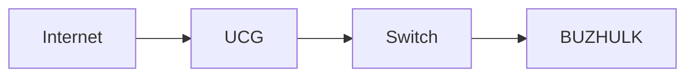

# Markdown in LeanDocs

LeanDocs stores every document as a plain `.md` file. This page lists what the viewer renders. Every feature degrades gracefully: in any other Markdown editor the file still reads well.

## Base

- **CommonMark** and **GitHub Flavored Markdown**: headings, lists, links, images, block quotes, code, tables, task lists (`- [ ]` / `- [x]`), strikethrough (`~~text~~`), autolinks and footnotes (`[^1]`).
- **Front matter** (YAML between `---` lines) holds `id`, `title`, `created`, `updated`, `tags`, `aliases`, `icon`, `description`. It is not shown in the document body. See PROJECT_SPEC §8–9.
- A first `# Heading` that matches the document title is not shown a second time under the title.

## Callouts

```markdown
:::warning
Do not enable Secure Boot for the HAOS VM.
:::

:::danger[Data loss]
Custom title in brackets.
:::
```

Types: `note`, `info`, `tip`, `warning`, `danger`. Other `:::name` blocks and inline `:name` text are shown literally, so text like `host:8080` or `image:latest` is never changed.

## Code

````markdown
```yaml
services:
  app:
    image: nginx
```
````

Code blocks show the language and a **Copy** button. Supported languages include the common set (bash/shell, yaml, json, xml/html, ini, sql, python, javascript/typescript, go, rust, diff, markdown, …) plus `dockerfile`, `nginx` and `powershell`. Code blocks without a language are shown as plain text.

## Diagrams (Mermaid)

````markdown

````

Diagrams render in strict security mode. An invalid diagram shows "Diagram rendering error" together with its source; the rest of the document still renders.

## Links between documents

| Syntax                                        | Meaning                                                               |
| --------------------------------------------- | --------------------------------------------------------------------- |
| `[[BUZHULK]]`                                 | Link by title (or file name, or path without `.md`; case-insensitive) |
| `[[BUZHULK#Hardware]]`                        | Link to a heading in that document                                    |
| `[[Home Assistant\|HA]]`                      | Custom link text                                                      |
| `[Backup](../Procedures/Backup%20Restore.md)` | Standard relative Markdown link: the most portable option             |

Links to documents that do not exist are shown muted with a dashed underline ("Document not found"). When you rename or move a document or folder in LeanDocs, links to it in other documents are updated in their files, so they keep working in other editors too. Wiki links are changed only when they would stop finding the document. Links in raw HTML are not updated.

## Raw HTML

Simple HTML such as `<details>`, `<summary>`, `<kbd>`, `<sup>` and `<sub>` is allowed. Anything that could run code — scripts, event handlers (`onclick=…`), `style`, iframes, forms, `javascript:` links — is removed before display (GitHub's sanitisation rules). Edit raw HTML in the Source view.

## Table of contents

The **Contents** panel on the right lists `##`–`####` headings and highlights the section you are reading. Every heading has an anchor, e.g. `/doc/<id>#hardware`.

## Images and attachments

Images and files stored next to a document (`Name.assets/…`) are shown and linked with normal relative Markdown. See [attachments.md](attachments.md).

## Not supported

- Math (KaTeX) and other extensions are out of scope for 1.0.
- Obsidian/GitHub alerts (`> [!note]`) are shown as ordinary quotes. Use `:::note` callouts instead.
