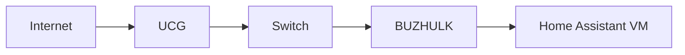

# BUZHULK

## Overview

Main production host for the homelab. Runs Docker for most services and Incus for the Home Assistant VM. See [[Home Assistant]] and [[VLAN]].

## Hardware

| Component | Value        |
| --------- | ------------ |
| Model     | GMKTEC G3    |
| CPU       | Intel N100   |
| RAM       | 32 GB        |
| Network   | Intel I226-V |

## Network



:::warning
Do not enable Secure Boot for the HAOS VM.
:::

## Docker

```yaml
services:
  vaultwarden:
    image: vaultwarden/server:latest
    restart: unless-stopped
    volumes:
      - ./vw-data:/data
```

Update all stacks with `docker compose pull && docker compose up -d`.

## Maintenance checklist

- [x] Weekly backup verified
- [ ] Firmware update
- [ ] Rotate SSH keys
